# 快速开发平台开发指南


​																	      中船重工信息科技有限公司
										                                                地址：北京市海淀区紫竹院路116号
										                                                            连云港市海州区海连东路42号
																			电话：0518-85823855

# 目录

[TOC]

# 一、简介 | Intro

## 1.平台架构
### 总体应用架构

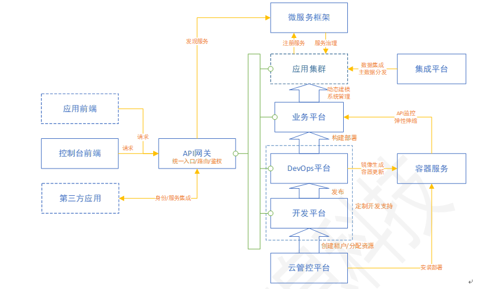

### 总体技术架构

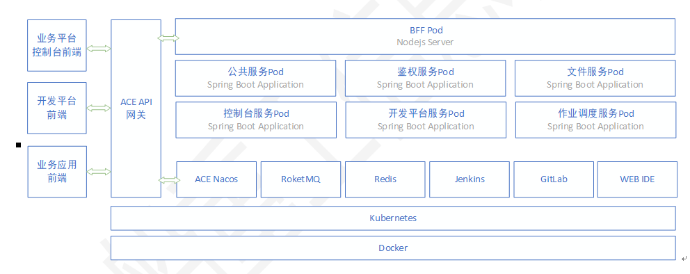

### 文件存储架构

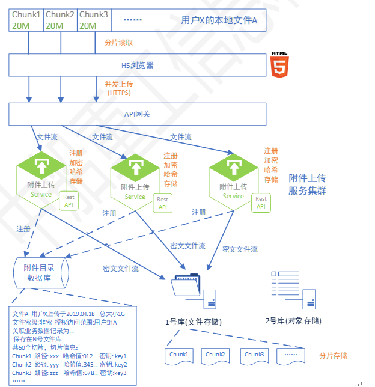

### 前端架构

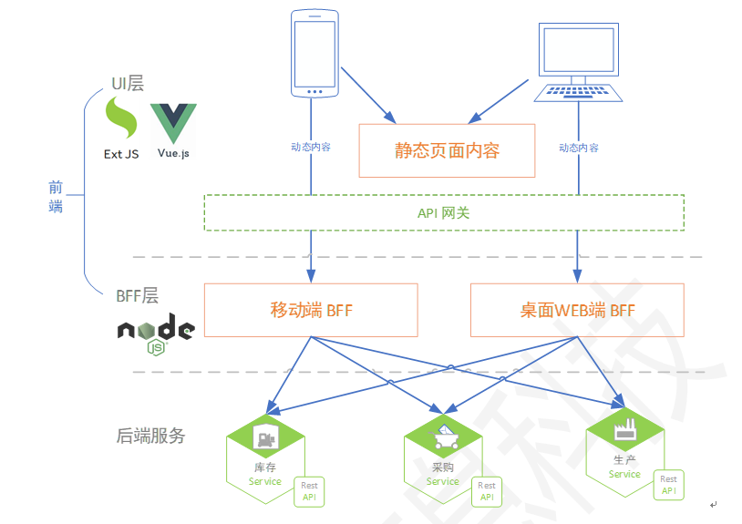

### nacos服务注册发现

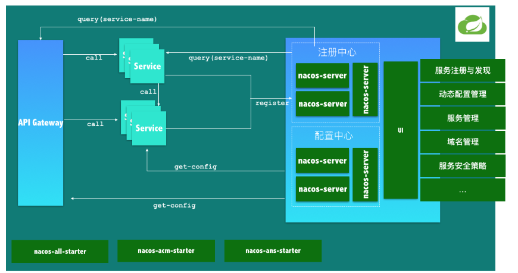

### 部署架构

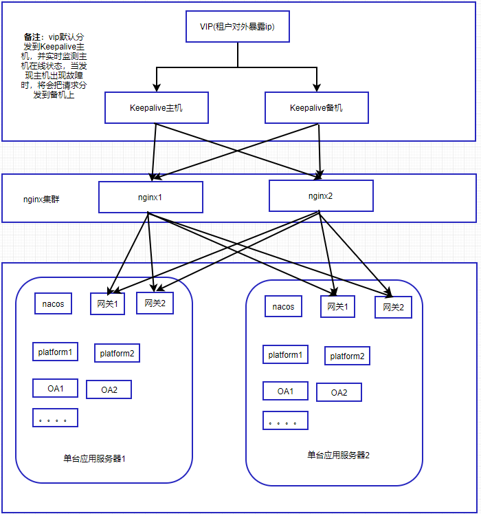

## 2.平台模块
中船重工ACE云应用平台（下称ACE平台）主要包括3个模块
* ace-server
> ace平台数据服务端
* ace-ui
> ace平台前端
* ace-bff
> ui容器以及提供后台数据聚合
# 二、开发环境
* 开发语言: java、node.js、vue
* 开发工具: Intellij IDEA(java服务端)、WebStorm(UI端、node服务端) 
* 开发环境: Window10
* 部署容器: Docker
* 微服务框架: Spring Cloud + Nacos
* 消息框架: Socket.io
* java版本: 1.8 
* java服务端开发框架: SpringBoot + MybatisPlus
* java编译工具: Apache-maven（3.x）
* 关系型数据库: 达梦、Mysql、Oracle
* 缓存数据库: Redis
# 三、环境准备
## 3.1 Docker安装
### 3.1.1 在线安装
`从 2017 年 3 月开始 docker 在原来的基础上分为两个分支版本: Docker CE 和 Docker EE。`
`Docker CE 即社区免费版，Docker EE 即企业版，强调安全，但需付费使用。`
`本文介绍 Docker-CE 的安装使用。`
1. 移除旧的版本
   ```
   $ sudo yum remove docker \
                     docker-client \
                     docker-client-latest \
                     docker-common \
                     docker-latest \
                     docker-latest-logrotate \
                     docker-logrotate \
                     docker-selinux \
                     docker-engine-selinux \
                     docker-engine
   ```
2. 安装必要的系统工具
   ```
   sudo yum install -y yum-utils device-mapper-persistent-data lvm2
   ```
3. 添加软件源信息
   ```
   sudo yum-config-manager --add-repo http://mirrors.aliyun.com/docker-ce/linux/centos/docker-ce.repo
   ```
4. 更新yum缓存
   ```
   sudo yum makecache fast
   ```
5. 安装Docker-ce
   ```
   sudo yum -y install docker-ce
   ```
6. 启动docker后台服务
   ```
   sudo systemctl start docker
   ```
7. 测试运行 hello-word
   ```
   docker run hello-world
   ```
### 3.1.2 离线安装
`不方便链接外网的机器，可采用离线安装。`
`本次安装的版本为 docker-18.06.3-ce`
`下载地址：https://download.docker.com/linux/static/stable/x86_64/docker-18.06.3-ce.tgz`
> `注意：安装包以提供`

1. 下载并解压
   ```
   tar zxvf docker-18.06.3-ce.tgz
   ```
2. 移动docker启动文件
   ```
   sudo cp docker/* /usr/bin/
   ```
3. 将docker注册为service
   ```
   vi /etc/systemd/system/docker.service
   ```
   `将下列配置加到docker.service中并保存`
   ```
   [Unit]
   Description=Docker Application Container Engine
   Documentation=https://docs.docker.com
   After=network-online.target firewalld.service
   Wants=network-online.target
   [Service]
   Type=notify
   # the default is not to use systemd for cgroups because the delegate issues still
   # exists and systemd currently does not support the cgroup feature set required
   # for containers run by docker
   ExecStart=/usr/bin/dockerd
   ExecReload=/bin/kill -s HUP $MAINPID
   # Having non-zero Limit*s causes performance problems due to accounting overhead
   # in the kernel. We recommend using cgroups to do container-local accounting.
   LimitNOFILE=infinity
   LimitNPROC=infinity
   LimitCORE=infinity
   # Uncomment TasksMax if your systemd version supports it.
   # Only systemd 226 and above support this version.
   # TasksMax=infinity
   TimeoutStartSec=0
   # set delegate yes so that systemd does not reset the cgroups of docker containers
   Delegate=yes
   # kill only the docker process, not all processes in the cgroup
   KillMode=process
   # restart the docker process if it exits prematurely
   Restart=on-failure
   StartLimitBurst=3
   StartLimitInterval=60s
   [Install]
   WantedBy=multi-user.target
   ```
4. 启动
   ```
   chmod +x /etc/systemd/system/docker.service             #添加文件权限并启动docker
   systemctl daemon-reload                                 #重载unit配置文件
   systemctl start docker                                  #启动Docker
   systemctl enable docker.service                         #设置开机自启
   ```
### 3.1.3 安装本地docker镜像仓库
#### 3.1.3.1 获取镜像
`在线，直接从远程仓库拉取` 
   ```
 docker pull registry
   ```
 `离线，可通过容器包导入` 
> `注意：容器包以提供`
 ```
 docker load -i registry.tar
 ```
#### 3.1.3.2 创建容器
 ```
 docker run -itd -p 5000:5000 --name registry01 -v /myregistry:/var/lib/registry registry 
 ```
`-d 是后台启动容器。`
`-p 将容器的 5000 端口映射到 Host 的 5000 端口。5000 是 registry 服务端口。`
`-v 将容器 /var/lib/registry 目录映射到 Host 的 /myregistry，用于存放镜像数据。`
`上传到本地的镜像保存在/myregistry/docker/registry/v2/repositories/ 下面`
#### 3.1.3.3 镜像上传
```
 docker tag image[:tag] xx.xx.xx.xx:5000/image[:tag]
```
`镜像名称由 repository 和 tag 两部分组成，默认为latest。可以在docker build 时用``格式image:tag指定，而 repository 的完整格式为：[registry-host]:[port]/[username]/xxx`
```
 docker push  xx.xx.xx.xx:5000/image[:tag]
```
#### 3.1.3.4 镜像获取
```
 docker pull xx.xx.xx.xx:5000/image[:tag]
```
> `注意：获取镜像可能会报错误，http: server gave HTTP response to HTTPS client，这是可以在”/etc/docker/“目录下，创建”daemon.json“文件。在文件中写入`
```
{ "insecure-registries":["xx.xx.xx.xx:5000"] }
```
>`保存退出后，重启docker`
```
systemctl restart docker
```
### 3.1.4 安装docker-compose
> `注意：容器包已提供`
```
cp -r docker-compose /usr/local/bin/
chmod +x /usr/local/bin/docker-compose
ln -s /usr/local/bin/docker-compose /usr/bin/docker-compose
docker-compose --version
```
`docker-compose学习文档`
```
https://docs.docker.com/compose/reference/up/
https://blog.csdn.net/qq_36148847/article/details/79427878
```

## 3.2 Nacos安装
### 3.2.1 docker容器方式启动  (单实例模式，非集群)
`直接从本地镜像仓库拉取` 
```
 docker pull xx.xx.xx.xx:5000/jnacos[:tag]
```
`或者，通过容器包导入` 
> `注意：容器包以提供`
```
docker load -i jnacos.tar
```
`创建容器`
 ```
docker run -itd -p 8848:8848 --name jnacos01 jnacos:1.0
 ```
`测试nacos，浏览器访问`
```
http://xx.xx.xx.xx:8848/nacos   用户名/密码：nacos/nacos
```
### 3.2.2 其他安装方式
`请参考官方教程` 
```
https://nacos.io/zh-cn/docs/what-is-nacos.html
```
## 3.3 Redis安装

### 3.3.1 docker容器方式启动
`直接从本地镜像仓库拉取` 
  ```
 docker pull xx.xx.xx.xx:5000/redis[:tag]
  ```
`或者，通过容器包导入` 
> `注意：容器包以提供`
```
docker load -i redis.tar
```
`创建容器`
 ```
docker run -itd -p 6379:6379 --name redis01 redis[:tag]
 ```
`测试redis，运行`redis客户端

```
docker exec -it redis01 redis-cli
```
### 3.3.2 其他安装方式

>`略...` 

## 3.4 Nginx安装

### 3.4.1 docker容器方式启动

`直接从本地镜像仓库拉取` 

```
 docker pull xx.xx.xx.xx:5000/nginx[:tag]
```

`或者，通过容器包导入` 

> `注意：容器包以提供`

```
docker load -i nginx.tar
```
`首先，创建nginx目录，用于存放nginx的相关文件`
```
mkdir -p /opy/nginx/logs /opt/nginx/conf
```
>`logs: 目录将映射为 nginx 容器的日志目录`
>`conf: 目录里的配置文件将映射为 nginx 容器的配置文件`

`复制配置文件nginx.conf到/opt/nginx/conf`
```
cp nginx.conf /opt/nginx/conf/
```
>`文件已提供`

`创建容器`
```
docker run -itd -p 8080:80 --name nginx01  -v /opt/nginx/conf/nginx.conf:/etc/nginx/nginx.conf -v  /opt/nginx/logs:/var/log/nginx  nginx
```
>`-p 8080:80： 将容器的 80 端口映射到主机的 8080 端口`
>`--name nginx01：将容器命名为 nginx01`
>`-v /opt/nginx/conf/nginx.conf:/etc/nginx/nginx.conf：将我们自己创建的 nginx.conf挂载到容器的 /etc/nginx/nginx.conf `
>`-v /opt/nginx/logs:/var/log/nginx：将我们自己创建的 logs挂载到容器的 /var/log/nginx`

`测试nginx，打开浏览器访问`
```
http://xx.xx.xx.xx:8080
```

`修改nginx配置，修改nginx.conf文件，重启nginx即可`
```
docker restart nginx01
```
### 3.4.2 其他安装方式

> `略...` 

## 3.5 JAVA1.8安装
>安装配置参考 https://blog.csdn.net/weixin_45264625/article/details/92768169

## 3.6 Maven 3安装
>安装配置参考 <https://blog.csdn.net/weixin_45264625/article/details/92771548> 

## 3.7 NodeJs 安装
> 安装配置参考 https://www.cnblogs.com/zhouyu2017/p/6485265.html
## 3.8 达梦数据库Docker安装
`通过容器包导入` 
> `注意：容器包以提供`
```
docker load -i ace-dm.tar
```
`创建容器`
```
docker run --privileged  -idt --name ace-dm -p 5236:5236 -v  ace-dm
```
`DM连接工具创建表空间，文件路径的目录请填写`
```
/opt/dm7data/data/
```
>`结果类似 /opt/dm7data/data/xxx.DBF`

`出现以下错误，请重启docker再执行相关操作`
```
docker: Error response from daemon: driver failed programming external connectivity on endpoint dm1 (237ee01e283bd3112616f73398e025c8868524a7f3654b2646475abefc282f4a):  (iptables failed: iptables --wait -t nat -A DOCKER -p tcp -d 0/0 --dport 5236 -j DNAT --to-destination 172.17.0.2:5236 ! -i docker0: iptables: No chain/target/match by that name.
```
`重启Docker`
```
systemctl restart docker
```

## 3.9 IDEA git配置
### 3.9.1 git 安装
> 安装配置参考 https://blog.csdn.net/qq_32786873/article/details/80570783
### 3.9.2 IDEA配置git
File–>Other Settings–>Default Settings–>Version Control–>Git
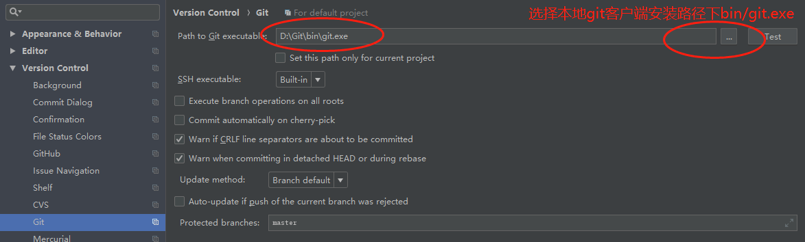

## 3.10 IDEA 插件配置
### 3.10.1 引入插件
File–>Settings–>Plugins 
在搜索框中输入需要用到的插件，点击install即可
### 3.10.2 平台目前在用插件
* lombok
* Free MyBatis plugin
* YAML

# 四、应用开发

## 4.1 JAVA服务端开发

### 4.1.1 快速开发平台开发步骤

1. 部署运行快速开发平台
2. 平台初始化配置及上传授权文件,授权文件会携带授权应用
3. 维护开发测试数据（建组织架构->建3员->建应用->获取应用id（比如aa-oa））
4. 拿到应用id（比如aa-oa），配置应用spring.application.name=aa-oa


### 4.1.2 新建SpringBoot项目

1)File->Project->New Project
2)选择Spring Initializr,SDK选择java1.8，点击Next
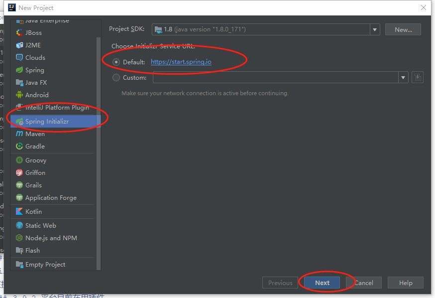
3)维护项目信息，点击Next
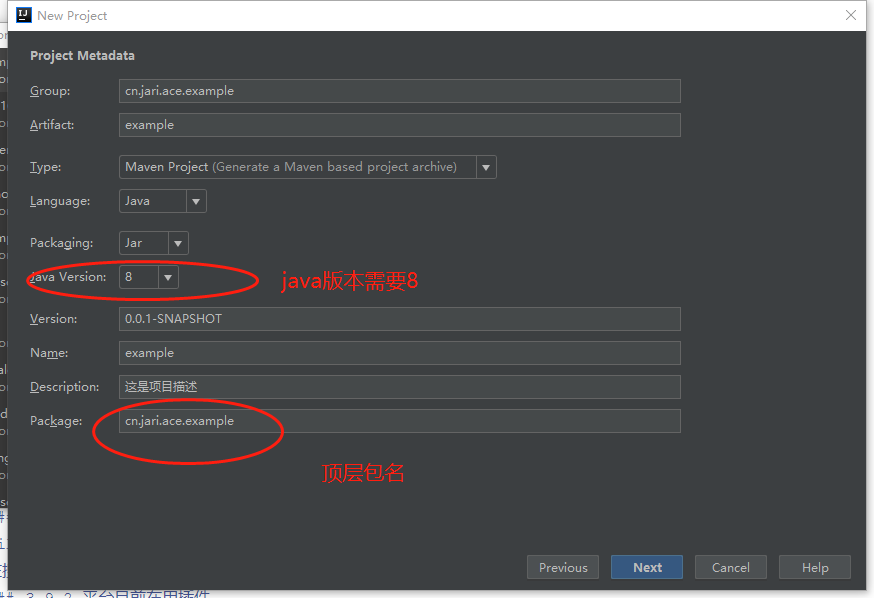
4)不用操作，点击Next
5)填写项目名称以及设置项目存放位置，点击Finish，SpringBoot项目搭建完毕。
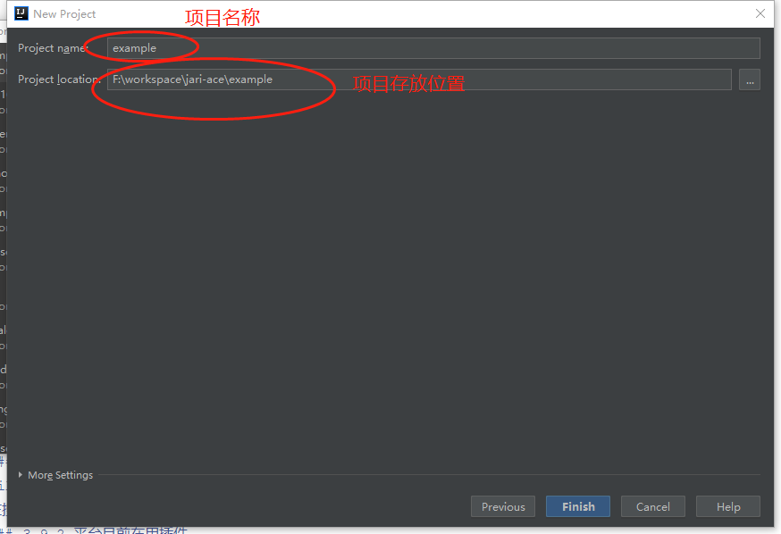

### 4.1.3 ACE快速开发平台依赖及配置
1）ACE平台提供文件
> * pom.xml:基于ACE平台开发所需jar包依赖
> * application.yml:spring-boot配置文件，该文件提供参考，配置了数据库连接以及日志及spring涉及的相关配置，仅供参考使用
> * bootstrap.yml:spring-boot配置文件，平台相关配置项
> * logback-spring.xml:logback日志配置文件
> * interfaces.jar: 平台公共接口包(包括工具包)
> * dbplus.jar: 平台数据服务掉用包
> * socket.io文件夹: 消息服务文件夹，包含了消息服务涉及的js文件
> * webuploader文件夹: 附件上传文件夹，包含了附件上传涉及的js文件

2）修改已创建项目的pom.xml文件
```
删除项目pom.xm文件中<dependencies></dependencies>标签中的内容，将我们提供的pom.xml文件中<dependencies></dependencies>标签中的内容复制到项目pom.xml文件的<dependencies></dependencies>标签内
```
3）拷入配置文件
```
 a) 在resources文件夹下拷入 bootstrap.yml,该文件中配置了项目的依托于平台的一些配置
 重点配置项
 ace.top.package.name  当前项目顶层包名
 ace.message.type 消息需要通知类型 
 b) 修改application.properties文件为application.yml,配置当前应用的相关配置
 c) 在resources文件夹下拷入logback-spring.xml，该文件配置了日志相关配置信息，可以根据自己需求进行相关配置
```
4）引入interfaces.jar及dbplus.jar
* maven方式引入
```
a.将两个jar包加入添加至Maven本地仓库
  打开cmd窗口，定位到jar包所在文件路径，执行如下语句
    mvn install:install-file -Dfile=interface.jar  -DgroupId=com.csicit.ace 
    -DartifactId=interface -Dversion=1.0.0 -Dpackaging=jar
    
    mvn install:install-file -Dfile=dbplus.jar  -DgroupId=com.csicit.ace 
    -DartifactId=dbplus -Dversion=1.0.0 -Dpackaging=jar
  备注:单位有私库，直接将jar包上传至maven私库
b.添加jar包依赖
 <dependency>
   <groupId>com.csicit.ace</groupId>
   <artifactId>interface</artifactId>
   <version>1.0.0</version>
 </dependency>
 <dependency>
   <groupId>com.csicit.ace</groupId>
   <artifactId>dbplus</artifactId>
   <version>1.0.0</version>
 </dependency>
```
* 本地jar方式引人
```
1)File->Project->Project Structure->Modules->Dependencies
2)点击右侧新增按钮，选择JARs or directoies
3)定位到jar包所在目录，选择jar包即可
```
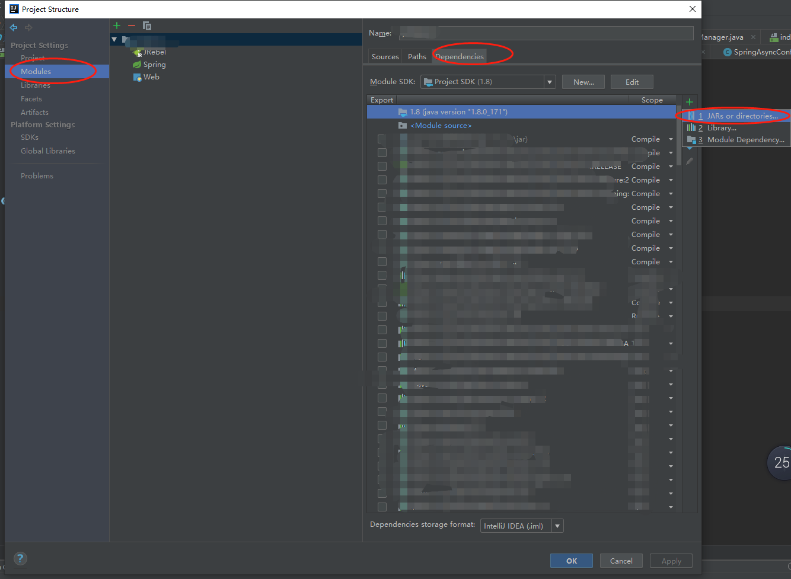

5) SpringBoot启动类设置

```
a)在项目启动类上添加如下配置
@SpringBootApplication(exclude = DataSourceAutoConfiguration.class)
@EnableDiscoveryClient
@ComponentScan({"com.csicit.ace"})
@EnableFeignClients({"com.csicit.ace"})
@MapperScan({"com.csicit.ace.dbplus.mybatis.mapper"})
b)在ComponentScan配置中添加你的顶层包名,
比如@ComponentScan({"com.csicit.ace"，“com.bat.est”})
c)在EnableFeignClients配置中添加你的顶层包名,
比如@EnableFeignClients({"com.csicit.ace"，“com.bat.est”})
d)在MapperScan配置中添加你的mybatis数据处理层包名,
比如@MapperScan({"com.csicit.ace.dbplus.mybatis.mapper"，“com.bat.est.mapper”})
```
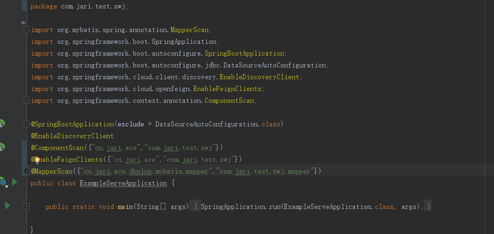


### 4.1.4 AceAuth注解使用配置
```
@AceAuth(value) 是人员调用权限的自定义主键，该注解注解类型为方法
加入该注解的方法在每次调用该方法前平台都会去查询该用户是否用户调用该方法的权限，有权限可以继续，无权限访问结束。
参数value值为该方法的功能描述
比如
@AceAuth("通过用户id获用户")
@RequestMapping(value = "/{id}", method = RequestMethod.GET)
public R get(@PathVariable("id") String id) {
User instance = userService.getById(id);
return R.ok().put("instance", instance);
}

```

### 4.1.5 消息推送服务前端配置


1. 在首页 （比如index.html页面中）引入相关js文件
```
<script type="text/javascript" src="<%= BASE_URL %>js/jquery-1.10.2.min.js"></script>
<script type="text/javascript" src="<%= BASE_URL %>js/socket.io.js"></script>
<script type="text/javascript" src="<%= BASE_URL %>js/public.js"></script>
```

2. 在登陆页调用 initSocketConnect（）方法
```
initSocketConnect(appId,callback)
appId : 应用id
callback ：回调函数，消息服务连接成功后回调函数
```

### 4.1.5 附件配置调用
1. 使用租户管理员创建文件存储库
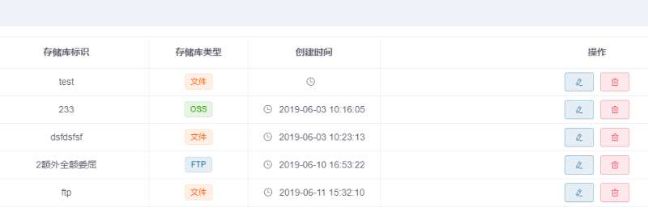
存储库类型可以选择文件、FTP或OSS，在日常使用中，一般创建的都是文件类型的存储库。
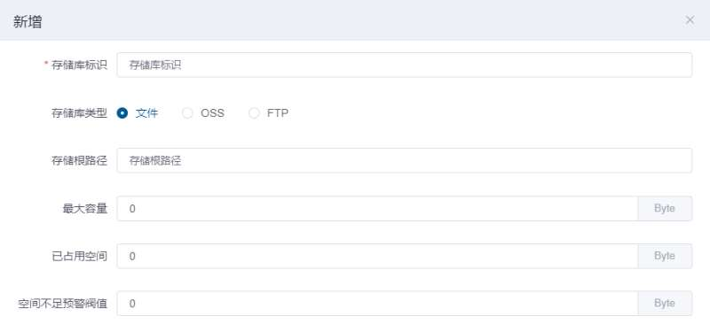
2. 创建附件配置项


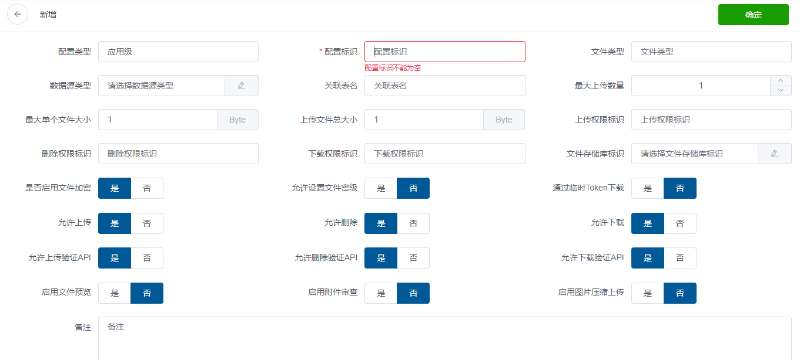
上图中配置标识、数据源、关联表名均为必填字段，其他属性。

3. 在使用附件控件时，仅需要在组件中导入FileUploader组件即可。 
```
import FileUploader from "../../common/components/uploader/FileUploader"
在要使用的位置添加如下标签：
<file-uploader ref="fileUploader" :configuration-key="configurationKey" :form-id="formId1" :allow-upload="allowUpload"
               :allow-download="allowDownload"/>
其中configuration-key和form-id为必填属性

```


