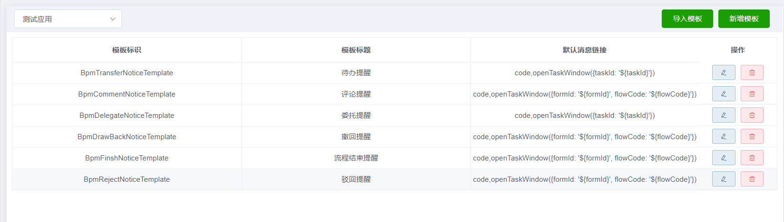
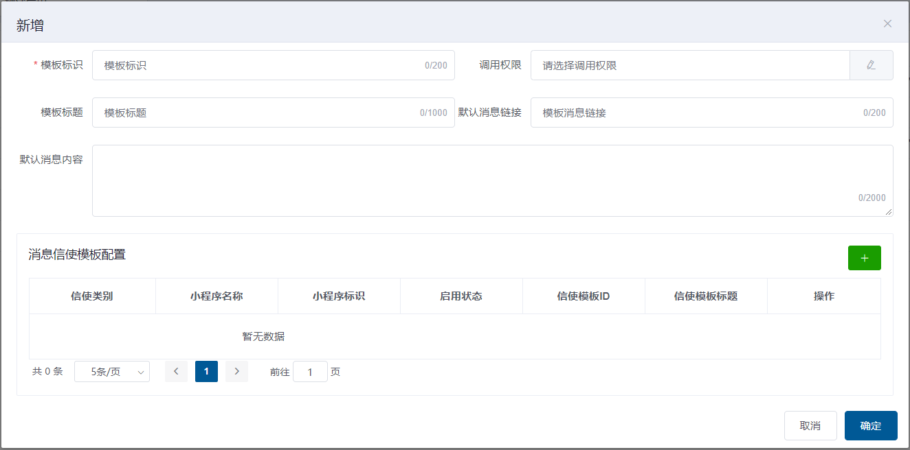
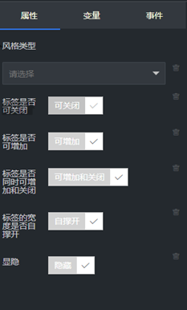

# 开发入门（持续更新中...）

[TOC]


## 后端开发入门

### 环境准备

#### 软件环境

| 软件名称         | 推荐版本  | 是否必须安装 | 备注 |
| ---------------- | --------- | ------------ | ---- |
| jdk              | 1.8.0_201 | 是           |      |
| apache-maven     | 3.5.3     | 是           |      |
| Intellij IDEA    | 2018.1.4  | 是           |      |
| Git              | 2.21.0    | 否           |      |
| MySQL Workbench  | 8.0       | 否           |      |
| 达梦数据库客户端 | 7.1       | 否           |      |
| Oracle client    | 12.1      | 否           |      |
| Toad for Oracle  | 12.0      | 否           |      |

#### 网络环境

如果是使用公共开发环境请下载网关（[内网下载](https://192.168.16.176/help/ace/gateway.jar)|[外网下载](https://oa.jarisoft.cn/help/ace/gateway.jar)），同时下载并启动脚本文件（[内网下载](https://192.168.16.176/help/ace/startGateway-218.cmd)|[外网下载](https://oa.jarisoft.cn/help/ace/startGateway-218.cmd)）。

运行后，如下图所示：


如果是使用本地部署的开发环境，则在本地下载和运行网关。

由于公共组件发布在maven中央库中，且依赖了大量公共包，因此在项目中添加依赖时，请保证可以从maven中央库获取相关文件。如果无法确认是否能够正确获取，则只需保证本机已接入互联网即可。

### 创建一个SpringBoot应用

#### 方法一 通过Spring Initializer创建


点击Next


输入Group、Artifact等信息，点击Next


添加如图所示Web中的Spring Web Starter依赖，点击Next，即创建完成。

至此，项目创建完成，新建项目结构如下图所示：


#### 方法二 通过修改maven项目创建


点击Next


输入Group、Artifact等信息，点击Next


修改pom.xml

在project节点下添加以下内容

```
<parent>
    <groupId>org.springframework.boot</groupId>
    <artifactId>spring-boot-starter-parent</artifactId>
    <version>2.2.0.RELEASE</version>
</parent>
<properties>
</properties>
<dependencies>
    <dependency>
    <groupId>org.springframework.boot</groupId>
    <artifactId>spring-boot-starter-web</artifactId>
    </dependency>
    <dependency>
    <groupId>org.springframework.boot</groupId>
    <artifactId>spring-boot-starter-test</artifactId>
    <scope>test</scope>
    </dependency>
</dependencies>
```

在java文件夹内新建顶层包


在顶层包内新建启动对象


为启动对象添加SpringBootApplication注解


在启动类中添加入口函数
```
public static void main(String[] args) {
    SpringApplication.run(SpringbootDemo1Application.class, args);
}
```
至此，我们通过创建maven项目的方式，创建了一个SpringBoot项目，新建项目结构如下图所示：


### Maven库配置

平台依赖了达梦数据库的驱动程序，而Maven中央库中没有，因此需要将[达梦驱动](https://oa.jarisoft.cn/help/ace/com.dm.driver-7.0.1.jar)上传至代理服务器或安装到本地。安装到本地的命令如下：

```
mvn install:install-file -DgroupId=com.dm -DartifactId=com.dm.driver -Dversion=7.0.1 -Dpackaging=jar -Dfile=com.dm.driver-7.0.1.jar
```

### 修改pom.xml文件

在project节点下properties内增加以下内容：

```
<java.version>1.8</java.version>
<!-- Spring Cloud Settings -->
<spring-cloud.version>Greenwich.RELEASE</spring-cloud.version>
<spring-cloud-alibaba.version>0.9.0.RELEASE</spring-cloud-alibaba.version>
<!-- Spring Boot Settings -->
<spring-boot-alibaba-druid.version>1.1.14</spring-boot-alibaba-druid.version>
<spring-boot-redis.version>1.4.7.RELEASE</spring-boot-redis.version>
<mybatis.version>3.4.6</mybatis.version>
```

在project节点下添加以下内容：

```
<dependencyManagement>
    <dependencies>
        <dependency>
            <groupId>org.springframework.cloud</groupId>
            <artifactId>spring-cloud-dependencies</artifactId>
            <version>${spring-cloud.version}</version>
            <type>pom</type>
            <scope>import</scope>
        </dependency>
        <dependency>
            <groupId>org.mybatis</groupId>
            <artifactId>mybatis</artifactId>
            <version>${mybatis.version}</version>
        </dependency>
    </dependencies>
</dependencyManagement>
```
为保证能够及时下载到最新jar包，请在project节点下添加以下内容：

```
    <repositories>
        <repository>
            <id>csicit-public</id>
            <name>csicit-public</name>
            <url>https://oa.jarisoft.cn/csicit-public/</url>
        </repository>
        <repository>
            <id>Sonatype Repository</id>
            <name>Sonatype</name>
            <url>https://oss.sonatype.org/content/repositories/releases/</url>
            <releases>
                <enabled>true</enabled>
            </releases>
            <snapshots>
                <enabled>true</enabled>
            </snapshots>
        </repository>
    </repositories>
```

在project节点下dependencies内添加以下内容：

```
<dependency>
    <groupId>org.springframework.boot</groupId>
    <artifactId>spring-boot-starter-redis</artifactId>
    <version>${spring-boot-redis.version}</version>
</dependency>
<dependency>
    <groupId>org.springframework.cloud</groupId>
    <artifactId>spring-cloud-starter</artifactId>
</dependency>
<dependency>
    <groupId>org.springframework.cloud</groupId>
    <artifactId>spring-cloud-starter-alibaba-nacos-discovery</artifactId>
    <version>${spring-cloud-alibaba.version}</version>
</dependency>
<dependency>
    <groupId>com.alibaba</groupId>
    <artifactId>fastjson</artifactId>
    <version>1.2.47</version>
</dependency>
```
如果是云版，请依赖一下内容：

```
<dependency>
    <groupId>com.csicit.ace</groupId>
    <artifactId>cloud-impl</artifactId>
    <version>1.0.43</version>
</dependency>
```

如果启用流程组件，请继续添加以下内容：

```
<dependency>
    <groupId>com.csicit.ace</groupId>
    <artifactId>bpm</artifactId>
    <version>1.1.25</version>
</dependency>
```

如果启用文件组件，请继续添加以下内容：

```
<dependency>
    <groupId>com.csicit.ace</groupId>
    <artifactId>file</artifactId>
    <version>1.0.39</version>
</dependency>
```

如果不启用流程组件，请继续添加以下内容：

```
<dependency>
    <groupId>com.csicit.ace</groupId>
    <artifactId>dbplus</artifactId>
    <version>1.0.39</version>
</dependency>
<dependency>
    <groupId>com.csicit.ace</groupId>
    <artifactId>interfaces</artifactId>
    <version>1.0.39</version>
</dependency>
```

### 建立工程目录结构

在java目录下添加以下几个Package：

在resources目录下添加mapper文件夹：


#### controller包
处理前台发送的请求。
文件命名规则：XxxController.java

#### mapper包
Mapper接口，方法名与Mapper.xml中定义的statement的id相同。
文件命名规则：XxxMapper.java

#### pojo包
定义Java对象，如JavaBean、json对象等。
文件命名规则：XxxDO.java、XxxVO.java

#### service包
定义接口（业务逻辑）。
文件命名规则：XxxService.java

#### service.impl包
对接口函数进行实现。
文件命名规则：XxxServiceImpl.java

#### mapper目录
写sql语句查询数据库。
文件命名规则：XxxMapper.xml

### 修改启动类
SpringBoot启动类上加入以下注解：
```
@EnableTransactionManagement
@EnableDiscoveryClient
@ComponentScan({"com.csicit.ace", "com.csicit.demo"})
@MapperScan({"com.csicit.demo.demo1.mapper""})
@AceInitScan("com.csicit.demo")
```
### 创建配置文件

#### 创建application.yml文件

在resources中，创建application.yml文件


在application.yml文件中添加以下内容
```
spring:
  http:
    encoding:
      charset: utf-8
      enabled: true
      force: true
  jackson:
      time-zone: GMT+8
      date-format: yyyy-MM-dd HH:mm:ss
      default-property-inclusion: non_null
  profiles:
    active: dev
  application:
    name: demo1
#mybatis
#mybatis-plus:
  mapper-locations: classpath*:mapper/**/*.xml
  #实体扫描，多个package用逗号或者分号分隔
  typeAliasesPackage: com.csicit.ace.bpm.pojo,com.csicit.ace.common.pojo
  global-config:
    #主键类型  0:"数据库ID自增", 1:"用户输入ID",2:"全局唯一ID (数字类型唯一ID)", 3:"全局唯一ID UUID";
    id-type: 0
    #字段策略 0:"忽略判断",1:"非 NULL 判断"),2:"非空判断"
    field-strategy: 2
    #驼峰下划线转换
    db-column-underline: true
    #刷新mapper 调试神器
    refresh-mapper: true
    #数据库大写下划线转换
    capital-mode: true
    #序列接口实现类配置
    #key-generator: com.baomidou.springboot.xxx
    #逻辑删除配置
    logic-delete-value: -1
    logic-not-delete-value: 0
    #自定义填充策略接口实现
    #meta-object-handler: com.baomidou.springboot.xxx
    #自定义SQL注入器
    #sql-injector: com.baomidou.mybatisplus.mapper.LogicSqlInjector
  configuration:
    map-underscore-to-camel-case: true
    cache-enabled: false
    call-setters-on-nulls: true
    jdbc-type-for-null: 'null'
logging:
  config: classpath:logback-spring.xml
  level:
    root: info
    com.csicit.ace: info
server:
  #不配置时为8080
  port: 8888
ace:
  top:
    package:
      name: com.csicit.demo.demo1
```
#### 创建application-dev.yml文件
在resources中，创建application-dev.yml文件

在application-dev.yml文件中添加以下内容

```
spring:
  cloud:
    nacos:
      discovery:
        server-addr: 218.92.85.58:8848
        ip: 127.0.0.1
  redis:
      #open: true  ## 是否开启redis缓存  true开启   false关闭
    database: 0
    host: 218.92.85.58
    port: 6379
    password: jarisoft
    timeout: 6000ms  ## 连接超时时长（毫秒）
    jedis:
      pool:
        max-active: 1000  ## 连接池最大连接数（使用负值表示没有限制）
        max-wait: -1ms      ## 连接池最大阻塞等待时间（使用负值表示没有限制）
        max-idle: 10      ## 连接池中的最大空闲连接
        min-idle: 5  ## 连接池中的最小空闲连接

  datasource:
    driver-class-name: dm.jdbc.driver.DmDriver
    url: jdbc:dm://aaa.bbb.ccc.ddd:5236
    username: DEMO1
    password: jarisoftdemo1
    druid:
      validation-query: select 1 from dual
      test-while-idle: true
ace:
  top:
    package:
      name: com.csicit.demo.demo1
```
#### 创建logback-spring.xml文件
在resources中，创建logback-spring.xml文件

在logback-spring.xml文件中添加以下内容

```
<?xml version="1.0" encoding="UTF-8"?>
<configuration>
    <include resource="org/springframework/boot/logging/logback/base.xml" />

    <appender name="LOGSTASH" class="net.logstash.logback.appender.LogstashTcpSocketAppender">
        <destination>172.16.93.129:5044</destination>
        <encoder charset="UTF-8" class="net.logstash.logback.encoder.LogstashEncoder" >
            <customFields>{"appname":"demo1"}</customFields>
        </encoder>
    </appender>
    <!--按天生成日志-->
    <appender name="LOGFILE"  class="ch.qos.logback.core.rolling.RollingFileAppender">
        <Prudent>true</Prudent>
        <rollingPolicy class="ch.qos.logback.core.rolling.TimeBasedRollingPolicy">
            <FileNamePattern>
                applog/demo1/%d{yyyy-MM-dd}/%d{yyyy-MM-dd}.log
            </FileNamePattern>
        </rollingPolicy>
        <layout class="ch.qos.logback.classic.PatternLayout">
            <Pattern>
                %d{yyyy-MM-dd HH:mm:ss} -%msg%n
            </Pattern>
        </layout>
    </appender>
    <root level="INFO">
        <appender-ref ref="LOGSTASH" />
        <appender-ref ref="CONSOLE" />
        <appender-ref ref="LOGFILE" />
    </root>
</configuration>
```

### 创建DO
在pojo包下创建名称为StudentDO.java对象，给该对象加上相应注解
```
@Data
@TableName("STUDENT")
public class StudentDO {
    /**
     * 主键
     */
    @Id
    @TableId(type = IdType.UUID)
    private String id;
    /**
     * 学号
     */
    private String studentNo;
    /**
     * 姓名
     */
    private String studentName;
}
```
### 创建mapper
在mapper包下创建名称为StudentMapper.java接口，给该接口加上@Mapper注解，并继承BaseMapper接口
```
@Mapper
public interface StudentMapper extends BaseMapper<StudentDO> {
}
```
### 创建Service

在service包下创建名称为StudentService.java接口，给该接口加上@Transactional注解，并继承IBaseService接口

```
@Transactional
public interface StudentService extends IBaseService<StudentDO> {
}
```
### 创建ServiceImpl
在service包下创建名称为impl的包，并在其中创建StudentServiceImpl.java对象，给该对象加上相应注解，继承，实现StudentService接口
```
@Service
public class StudentServiceImpl extends BaseServiceImpl<StudentMapper, StudentDO> implements StudentService {
}
```
### 创建Controller
在controller包下创建名称为StudentController.java的对象，给该对象加上@RestController和@RequestMapping("/student")注解，并继承BaseController

```
@RestController
@RequestMapping("/student")
public class StudentController extends BaseController {
    @Autowired
    private StudentService studentService;

    @AceAuth("获取单个学生")
    @RequestMapping(value = "/{id}", method = RequestMethod.GET)
    public R get(@PathVariable("id") String id) {
        StudentDO student = studentService.getById(id);
        return R.ok().put("instance", student);
    }

    @AceAuth("获取学生列表并分页")
    @RequestMapping(method = RequestMethod.GET)
    public R list(@RequestParam Map<String, Object> params) {
        int current = Integer.parseInt(params.get("current").toString());
        int size = Integer.parseInt(params.get("size").toString());
        Page<StudentDO> page = new Page<>(current, size);
        IPage list = studentService.page(page, new QueryWrapper<>());
        return R.ok().put("page", list);
    }

    @AceAuth("保存学生对象")
    @RequestMapping(method = RequestMethod.POST)
    public R save(@RequestBody StudentDO instance) {
        if (studentService.save(instance)) {
            return R.ok(InternationUtils.getInternationalMsg("SAVE_SUCCESS"));
        }
        return R.error(InternationUtils.getInternationalMsg("SAVE_FAILED"));
    }

    @AceAuth("修改学生对象")
    @RequestMapping(method = RequestMethod.PUT)
    public R update(@RequestBody StudentDO instance) {
        if (studentService.updateById(instance)) {
            return R.ok(InternationUtils.getInternationalMsg("UPDATE_SUCCESS"));
        }
        return R.error(InternationUtils.getInternationalMsg("UPDATE_FAILED"));
    }

    @AceAuth("删除学生对象")
    @RequestMapping(method = RequestMethod.DELETE)
    public R delete(@RequestBody String[] ids) {
        if (studentService.removeByIds(Arrays.asList(ids))) {
            return R.ok(InternationUtils.getInternationalMsg("DELETE_SUCCESS"));
        }
        return R.error(InternationUtils.getInternationalMsg("DELETE_FAILED"));
    }
}
```

### 结束

至此，一个完整的后端项目创建完成

## 前端开发入门

### 环境准备

#### 软件环境

| 软件名称      | 推荐版本 | 是否必须安装 | 备注               |
| ------------- | -------- | ------------ | ------------------ |
| Intellij IDEA | 2018.1.4 | 是           | 需要安装VUE.js插件 |
| Node.js       | 11.6.0   | 是           |                    |

### 搭建项目

平台提供Vue应用前端框架（[内网下载](https://192.168.16.176/help/ace/ace-vue-app-frame.zip)|[外网下载](https://oa.jarisoft.cn/help/ace/ace-vue-app-frame.zip)），下载后将工程解压至目标路径，如demo1-vue，如下图所示。


*注：框架详细指南见上图中README.md。*

在idea中打开demo1-vue项目，如下图所示。


在Terminal中输入npm install，按回车键，安装依赖项


修改platFormConfig.js，配置以下属性

```
httpRequestUrl:'localhost:2100',
```

### 创建student文件夹

在src/views文件夹下，新建student文件夹，并在其中新增views和components文件夹


### 创建编辑页面

在src/views/student/components文件夹下，创建名称为add-or-update的vue文件

```
<template>
    <el-dialog
            :title="isInserting ? '新增':'修改'"
            :close-on-click-modal="false"
            :visible.sync="visible"
            width="900px"
            append-to-body>
        <el-form :model="dataForm" :rules="dataRule" ref="dataForm"
                 @keyup.enter.native="dataFormSubmit()" label-width="80px">
            <el-form-item label="学号" prop="studentNo">
                <el-input v-model="dataForm.studentNo" placeholder="学号"></el-input>
            </el-form-item>
            <el-form-item label="姓名" prop="studentName">
                <el-input v-model="dataForm.studentName" placeholder="姓名"></el-input>
            </el-form-item>
        </el-form>
        <span slot="footer" class="dialog-footer">
        <el-button @click="visible = false">取消</el-button>
        <el-button type="primary" @click="dataFormSubmit()" :disabled="isSubmitDisable">确定</el-button>
      </span>
    </el-dialog>
</template>

<script>
    export default {
        name: "add-or-update",
        data() {
            return {
                //表单重复提交
                isSubmitDisable: false,
                isInserting: true,
                visible: false,
                //message实例容器  用于关闭上一个message
                messageBox: null,
                dataForm: {
                    id: '',
                    studentNo: '',
                    studentName: ''
                },
                dataRule: {
                    studentNo: [
                        {required: true, message: '学号不能为空', trigger: 'blur'}
                    ],
                    studentName: [
                        {required: true, message: '姓名不能为空', trigger: 'blur'}
                    ]
                }
            }
        },
        methods: {
            init(id) {
                if (this.$refs['dataForm'] !== undefined) {
                    this.$refs['dataForm'].resetFields()
                }
                this.isInserting = id === '' || id === undefined
                this.dataForm.id = id
                this.visible = true
                // 新增
                if (this.isInserting) {
                    this.dataForm.studentNo = ''
                    this.dataForm.studentName = ''
                } else {
                    // 修改
                    this.$http({
                        url: this.$http.adornUrl('/demo1/student/' + this.dataForm.id, false),
                        methods: 'get'
                    }).then(({data}) => {
                        if (data && data.code === 40000) {
                            this.dataForm.studentNo = data.instance.studentNo
                            this.dataForm.studentName = data.instance.studentName
                        }
                    })
                }
            },
            // 表单提交
            dataFormSubmit() {
                this.isSubmitDisable = true
                this.$refs['dataForm'].validate((valid) => {
                    if (valid) {
                        this.$http({
                            url: this.$http.adornUrl('/demo1/student', false),
                            method: this.isInserting ? 'post' : 'put',
                            data: this.$http.adornData({
                                'id': this.dataForm.id || undefined,
                                'studentNo': this.dataForm.studentNo,
                                "studentName": this.dataForm.studentName

                            })
                        }).then(({data}) => {
                            if (data && data.code === 40000) {
                                this.messageBox && this.messageBox.close();
                                this.messageBox = this.$message({
                                    message: data.msg,
                                    type: 'success',
                                    duration: 1500
                                });
                                this.visible = false;
                                this.$emit('refreshDataList')
                            } else {
                                this.messageBox && this.messageBox.close();
                                this.messageBox = this.$message.error(data.msg)
                            }
                        })
                    }
                });
                setTimeout(() => {
                    this.isSubmitDisable = false
                }, 500)
            }
        }
    }
</script>
```


### 创建浏览页面

在src/views/student/views文件夹下，创建名称为list的vue文件

```
<template>
    <article class="sub-page parent-dom">
        <!-- 弹窗，新增/修改-->
        <add-or-update ref="addOrUpdate" @refreshDataList="getDataList"></add-or-update>
        <sub-page-card-box footer>
            <el-row slot="body">
                <el-col :span="24" class="text-align-right">
                    <el-tooltip class="item" effect="dark" content="新增" placement="top-start">
                        <el-button type="success" icon="el-icon-plus"
                                   size="medium"
                                   @click="addOrUpdateHandle()"></el-button>
                    </el-tooltip>
                </el-col>
                <el-col :span="24">
                    <el-table
                            :data="dataList"
                            border
                            row-key="id"
                            style="width: 100%;">
                        <el-table-column
                                prop="id"
                                v-if="false">
                        </el-table-column>
                        <el-table-column
                                prop="studentNo"
                                align="center"
                                label="学号"
                                :show-overflow-tooltip="true">
                        </el-table-column>
                        <el-table-column
                                prop="studentName"
                                align="center"
                                label="姓名"
                                :show-overflow-tooltip="true">
                        </el-table-column>
                        <el-table-column
                                fixed="right"
                                header-align="center"
                                align="center"
                                width="150"
                                label="操作">
                            <template slot-scope="scope">
                                <el-button
                                        size="mini"
                                        type="primary"
                                        plain
                                        title="修改"
                                        icon="el-icon-edit"
                                        @click="addOrUpdateHandle(scope.row.id)">
                                </el-button>
                                <el-button
                                        size="mini"
                                        type="danger"
                                        plain
                                        title="删除"
                                        icon="el-icon-delete"
                                        @click="deleteHandle(scope.row.id, scope.row.studentNo)">
                                </el-button>
                            </template>
                        </el-table-column>
                    </el-table>
                </el-col>
            </el-row>
            <el-pagination slot="footer"
                           @size-change="sizeChangeHandle"
                           @current-change="currentChangeHandle"
                           :current-page="current"
                           :page-sizes="[10, 20, 50, 100]"
                           :page-size="size"
                           :total="total"
                           layout="total, sizes, prev, pager, next, jumper">
            </el-pagination>
        </sub-page-card-box>
    </article>
</template>

<script>
    import addOrUpdate from '../components/add-or-update'

    export default {
        name: 'Menu',
        data() {
            return {
                dataList: [],
                dataListLoading: false,
                currentOrgGroupId: '',
                current: 1,
                size: 10,
                total: 0,
                //message实例容器  用于关闭上一个message
                messageBox: null
            }
        },
        components: {
            addOrUpdate
        },
        created() {
            this.getDataList()
        },
        methods: {
            // 每页数
            sizeChangeHandle(val) {
                this.size = val
                this.current = 1
                this.getDataList()
            },
            // 当前页
            currentChangeHandle(val) {
                this.current = val
                this.getDataList()
            },
            getDataList() {
                this.dataList = []
                this.dataListLoading = true
                this.$http({
                    url: this.$http.adornUrl('/demo1/student', false),
                    method: 'get',
                    params: this.$http.adornParams({
                        'current': this.current,
                        'size': this.size
                    })
                }).then(({data}) => {
                    if (data && data.code === 40000) {
                        if (data.page !== undefined) {
                            this.dataList = data.page.records
                            this.total = data.page.total
                        } else {
                            this.dataList = []
                            this.total = 0
                        }
                    } else {
                        this.dataList = []
                    }
                    this.dataListLoading = false
                })
            },
            // 新增 / 修改
            addOrUpdateHandle(id) {
                this.$nextTick(() => {
                    this.$refs.addOrUpdate.init(id)
                })
            },
            // 删除
            deleteHandle(id, studentNo) {
                this.$confirm(`确定对学号为[${studentNo}]进行[删除]操作?`, '提示', {
                    confirmButtonText: '确定',
                    cancelButtonText: '取消',
                    type: 'warning'
                }).then(() => {
                    this.$http({
                        url: this.$http.adornUrl('/demo1/student', false),
                        method: 'delete',
                        data: this.$http.adornData([id])
                    }).then(({data}) => {
                        if (data && data.code === 40000) {
                            this.messageBox && this.messageBox.close();
                            this.messageBox = this.$message({
                                message: '操作成功',
                                type: 'success',
                                duration: 1500,
                                onClose: () => {
                                }
                            });
                            this.getDataList()
                        } else {
                            this.messageBox && this.messageBox.close();
                            this.messageBox = this.$message.error(data.msg);
                        }
                    })
                }).catch(() => {
                })
            }
        }
    }
</script>
```

### 添加静态菜单（调试用）

在src/router/routerStatic.js文件中routerStatic.childrenRouter数组中添加以下元素

```
{
        icon: "fa fa-cubes",
        isTab:true,
        id: "student",
        iframe: 0,
        name: "学生信息",
        url: "views/student/views/list"
    }
```


### 运行项目

在Terminal中输入npm run serve，回车即可运行项目。

### 访问项目

租户三员、集团三员和应用三员，在浏览器中访问http://localhost:2100。

普通用户，在浏览器中输入http://localhost:2200。

## 快速开发

用户可以使用我们的快速开发平台来进行开发。首先登录自己的管理员账户，可以看到如下图所示。


### 添加项目信息

选择左侧的项目信息，点击右侧的加号按钮，新增自己的项目。


填写必要的信息，并且选择相应的开发人员。


### 添加数据源管理

选择左侧的数据源管理，点击右侧的新增按钮，根据输入框的要求输入你的信息


### 添加模型管理

选择服务管理中的模型管理


点击对象模型的新增按钮，根据你的需求填入对应信息：


点击确定后，左侧列表中会出现你所新增的表：


选择你刚刚新建的表，点击右侧的模型属性的新增，根据你的需求填写字段信息：


填写完成后，点击生成模型服务代码后生成一个压缩包：


解压压缩包后生成2个文件夹，分别是前端和后端：


然后根据我们的角手架文件配置下进行快速开发。

## 配置管理

### 系统配置

应用启动时，会自动扫描配置项，并保存在数据库以及缓存。另外，平台服务启动时也会加载所有的配置项到缓存数据库。在程序运行过程中，会自动给属性赋值。 

在项目中添加一个FirstConfigs类

（1）需要给类加上注解 @AceConfigClass 

（2）需要给字段加上注解 @AceConfigField 

（3）变量必须标注为 静态变量且 必须用 public修饰 

代码如下：

```
@AceConfigClass
public class FirstConfigs {
    @AceConfigField(defaultValue = "aa2",scopes = {1, 2 ,3})
    public  static  String aa2;

    @AceConfigField(defaultValue = "2020-07-24 16:22:00",scopes = {2 ,3})
    public static LocalDateTime aa121;
}
```

使用：

（1）getConfig(String key, Class<?> classz) 

（2）Key 配置项名称

（3）Classz 返回值泛型

```
 @Autowired
    AceConfigService aceConfigService;
    
    @RequestMapping(value = "/test",method = RequestMethod.GET)
    public R testT() {
        String aaa = aceConfigService.getConfig("aa2",String.class);
        LocalDateTime aaa22 = aceConfigService.getConfig("aa121",LocalDateTime.class);
        System.out.println(aceConfigService.getConfig("aa121",LocalDateTime.class));
        return R.ok();
    }
```

项目启动后，即可看到应用下面的配置项信息


选择需要编辑的配置项，点击操作栏中的按钮。弹出配置项编辑页面，修改配置项信息，点击“确定”按钮，系统关闭配置项编辑页面，刷新配置项列表页面。 

### 附件配置

#### 页面功能

使用应用管理员账号登录，点击配置管理->附加配置 进入平台应用级附件配置界面 。

 

新增：点击右上角新增按钮，系统弹出新增页面。填写附件配置信息，点击“确定”按钮，关闭新增页面，刷新附件配置列表页面。

编辑：选择需要编辑的附件配置项，点击操作栏中的编辑按钮。系统弹出信息编辑页面，点击“确定”按钮，关闭信息编辑页面，提示保存成功，刷新附件配置信息列表页面。

删除：选择需要删除的附件配置项，点击操作栏中的删除按钮。系统弹出删除提示框，点击“确定”按钮，关闭提示框，提示删除成功，刷新附件配置列表信息页面。

#### 新增存储库

登录租户管理员，找到配置管理->附件存储，可以看到相应的列表。 


使用租户管理员创建文件存储库存储库类型可以选择文件、FTP或OSS，在日常使用中，一般创建的都是文件类型的存储库。 


#### 新增数据源

登录应用管理员账号，首先在数据源管理中创建一个属于自己的数据源，输入相关信息后点击确定按钮。


#### 新增附件配置

选择左侧的附件配置，点击新增按钮，根据需求填入相应的信息，其中文件存储库标识要选择你刚刚新建的存储库标识，填写完毕后点击确定按钮，其中配置标识、数据源、关联表名均为必填字段。


在使用附件控件时，仅需要在组件中导入FileUploader组件即可

```
import FileUploader from "../../common/components/uploader/FileUploader"
在要使用的位置添加如下标签：
<file-uploader ref="fileUploader" 
			  :configuration-key="configurationKey" 
			  :form-id="formId1" 
			  :allow-upload="allowUpload" 
			  :allow-download="allowDownload"/>

其中configuration-key和form-id为必填属性
configuration-key为上面创建的配置标识

```

### 权限定义

#### 页面功能

使用应用管理员账号登录，点击配置管理->权限定义 进入权限定义界面。

 

新增一级权限：点击右上角新增按钮，系统弹出新增权限页面。填写权限信息，选择权限API并勾选，点击“确定”按钮，关闭新增权限页面，刷新权限列表页面。 

 


新增下级权限：选择需要添加下级权限的父级数据项，点击操作栏中新增按钮，系统弹出新增权限页面。填写权限信息，选择权限API并勾选，点击“确定”按钮，关闭新增权限页面，刷新权限列表页面。

编辑：选择需要编辑的权限，点击操作栏中的编辑按钮。系统弹出权限信息编辑页面，修改信息后点击“确定”按钮，关闭权限信息编辑页面，提示保存成功，刷新权限列表页面。

删除：选择需要删除的权限，点击操作栏中的编辑按钮。系统弹出删除提示框，点击“确定”按钮，关闭提示框，提示删除成功，刷新权限列表信息页面。

添加API：选择需要添加API的权限，点击操作栏中新增按钮，系统弹出添加API页面，如图 129所示。选择需要添加的API，勾选后点击“确定”按钮，系统关闭添加API页面，提示操作成功。

 

#### API的注入

在controller上添加这个注解

```
@AceAuth(value = "测试000001")

例如：
    @AceAuth(value = "测试000001")
    public R get(@PathVariable("id") String id) {
        String a = "aaaaaaa";
        return R.ok().put("instance", a);
    }
```

### 定时任务

使用应用管理员账号登录，点击配置管理->定时任务 进入定时任务界面。 

 

暂停服务：在运行监控界面上，点击右上角暂停按钮，正在运行中的服务都会处于暂停状态。点击列表最后列中的暂停按钮，该数据行的服务会暂停。

运行服务：点击右上角运行按钮，处于暂停状态的服务都会运行起来。点击列表最后列中的运行按钮，该数据行的服务会启动。

刷新操作：点击右上角刷新按钮，服务监控列表会刷新一次。

点击任务配置Tab，进入增删改查任务的界面。


定时任务注入

在controller上添加这个注解

```
@AceScheduled(name="test",url = "/tests_GET",group = "tt01")

例如：
@AceScheduled(name="test",url = "/tests_GET",group = "tt01")
    public R get(@PathVariable("id") String id) {
       String a = "aaaaaaa";
        return R.ok().put("instance", a);
    }
```

点击右上角新增下拉框按钮可选择任务、触发器、运行参数选项添加配置 。

新增服务：点击新增下拉框中的任务选项，界面出现新增服务页面。填写服务配置信息，点击“保存”按钮，页面自动刷新，在页面的左侧列表中，新增服务排列在“所有任务”的下级列表中。 


新增触发器：选中左侧任务树的指定任务数据项，再点击新增下拉框选中触发器选项，界面出现新增触发器页面。填写触发器配置信息，点击“保存”按钮，页面自动刷新，在页面的左侧列表中，新增触发器排列在指定任务的触发器下级列表中。


新增运行参数：选中左侧任务树的指定任务数据项，再点击新增下拉框选中运行参数选项，界面出现新增运行参数页面。填写运行参数配置信息，点击“保存”按钮，页面自动刷新，在页面的左侧列表中，新增参数排列在指定任务的运行参数下级列表中 


编辑删除服务：选中左侧菜单树的指定任务数据项，界面显示指定任务的配置信息。修改服务配置后，通过点击“保存”按钮，提交任务配置信息，并刷新页面；通过点击“删除”按钮，删除该任务及任务下的触发器和参数，并刷新页面。

### 消息通道

使用租户管理员账号登录，点击配置管理->消息配置->消息通道 进入消息通道配置项界面 。


新增：点击右上角的新增按钮，弹出新增消息通道页面。填写消息通道信息，点击“确定”按钮，关闭新增页面，刷新消息通道列表。 

 

编辑：选择需要编辑的消息通道，点击操作栏中的编辑按钮，系统弹出编辑页面，输入修改后的消息通道信息，点击“确定”按钮，系统关闭编辑页面，刷新消息通道信息页面 

删除：找到需要删除的消息通道，点击操作栏中的删除按钮，系统弹出确认删除提示框。点击“确定”按钮，关闭提示框，提示删除成功，刷新消息通道信息页面。

#### 使用方法

```
* @param receivers	 消息接收人 不能为空
* @param channelName	频道名称
* @param templateId	平台消息模板标识
* @param data 消息模板内容替换参数
    @Autowired
    IMessage iMessage;

    @RequestMapping(value = "/test",method = RequestMethod.GET)
    public R testC(List<String> receivers,String channelName,String templateId,Map<String,Object> data) {
        iMessage.sendMessage(receivers,channelName,templateId,data);
        return R.ok();
    }
```

### 字典维护

使用应用管理员账号登录，点击配置管理->字典维护 进入字典维护界面。应用级管理员可以查询租户级、集团级字典以及维护应用级字典内容。 

点击“应用”Tab，进入应用级字典维护界面 。

 

新增字典类型：点击右上角“+ 字典类型”按钮，系统弹出新增字典类型页面。填写字典类型信息，点击“确定”按钮，关闭新增页面，刷新字典类型列表。

编辑字典类型：选择需要编辑的字典类型，点击操作栏中编辑按钮，系统弹出编辑字典类型页面。编写需要修改的信息，点击“确定”按钮。系统关闭编辑页面，刷新字典类型列表。

删除字典类型：选择需要删除的字典类型，点击操作栏中删除按钮。系统弹出删除提示框，点击“确定”按钮，关闭系统提示框，刷新字典类型列表。

新增字典数据：选择字典类型，点击“+ 字典数据”按钮，系统弹出字典数据新泽页面。填写字典数据信息，点击“确定”按钮，关闭新增页面，刷新字典数据列表。

新增下级字典数据：选择需要添加下级字典数据的数据项，点击操作栏中的新增按钮。系统弹出新增页面。填写字典数据信息，点击“确定”按钮，关闭新增页面，刷新字典数据列表。

编辑字典数据：选择需要编辑的字典数据项，点击操作栏中的编辑按钮。系统弹出字典数据编辑页面，修改字典数据信息，点击“确定”按钮，关系字典数据编辑页面，刷新字典数据列表。

删除字典数据：选择需要删除的字典数据项，点击操作栏中删除按钮。系统弹出删除提示框，点击“确定”按钮，提示删除成功，刷新字典数据列表。

#### 使用方法

```
@Autowired
    IDict iDict;
    
* @param test 字典类型
public R testB(@PathVariable("test") String test) {
       iDict.getValue(test);
        return R.ok();
    }
```

### 消息模板

#### 页面功能



新增模板：点击右上角“新增模板”按钮，系统弹出新增页面。填写相应的模板信息，点击“确定”按钮，关闭新增页面，刷新消息模板列表。



编辑消息模板：选择需要编辑的消息模板，点击操作栏中编辑按钮，系统弹出编辑消息模板页面。编写需要修改的信息，点击“确定”按钮。系统关闭编辑页面，刷新消息模板列表。

删除消息模板：选择需要删除的消息模板，点击操作栏中删除按钮。系统弹出删除提示框，点击“确定”按钮，关闭系统提示框，刷新消息模板列表。

### 接口管理

#### 页面功能


新增接口：点击右上角新增按钮，系统弹出新增页面。填写相应的接口信息，点击“确定”按钮，关闭新增页面，刷新接口管理列表。


删除接口：选择需要删除的接口，点击操作栏中删除按钮。系统弹出删除提示框，点击“确定”按钮，关闭系统提示框，刷新接口列表。

### 数字序列

#### 页面功能


新增数字序列：点击右上角新增按钮，系统弹出新增页面。填写相应的信息，点击“确定”按钮，关闭新增页面，刷新数字序列列表。


#### 使用方法

```
   IAceCode
   
   /** 
     *  返回数字序列编号
     *  
     * @param appId	 应用id
     * @param seqBizTag	 数字序列标识
     * @return java.lang.String
     * @author shanwj
     * @date 2020/7/3 10:40
     */
    String getNextNum(@NonNull String appId,@NonNull String seqBizTag);
    /** 
     * 返回数字序列编号
     *
     * @param appId	 应用id
     * @param seqBizTag 数字序列标识
     * @param partValueTag 数字序列次要标识
     * @return java.lang.String
     * @author shanwj
     * @date 2020/7/3 10:40
     */
    String getNextNum(@NonNull String appId,@NonNull String seqBizTag,@NonNull String partValueTag);
    /**
     * 获取业务编码
     *
     * @param appId 业务编码
     * @param templateKey 业务编码标识
     * @return
     */
    String getTemplateCode(String appId,String templateKey);
    /**
     * 获取业务编码
     *
     * @param appId 业务编码
     * @param templateKey 业务编码标识
     * @param params 参数部件替换参数
     * @return
     */
    String getTemplateCode(String appId,String templateKey,Map<String,String> params);

    ICode
    
    /**
     * 根据规则获取编码
     * @param rule 规则
     * @return 编码
     */
    String getCode(String rule);

    /**
     * 根据规则及单个编码获取编码
     * @param rule 规则
     * @param code 编码
     * @return 编码
     */
    String getCode(String rule, String code);

    /**
     * 根据规则及2个编码获取编码
     * @param rule 规则名称
     * @param firstCode 编码
     * @param secondCode 编码
     * @return 编码
     */
    String getCode(String rule, String firstCode, String  secondCode);
```

### 服务编码

#### 页面功能


新增服务编码：点击右上角新增按钮，系统弹出新增页面。填写相应的信息，点击“确定”按钮，关闭新增页面，刷新服务编码列表。


#### 使用方法

```
   IAceCode
   
   /** 
     *  返回数字序列编号
     * @param appId	 应用id
     * @param seqBizTag	 数字序列标识
     * @return java.lang.String
     */
    String getNextNum(@NonNull String appId,@NonNull String seqBizTag);
    /** 
     * 返回数字序列编号
     *
     * @param appId	 应用id
     * @param seqBizTag 数字序列标识
     * @param partValueTag 数字序列次要标识
     * @return java.lang.String
     */
    String getNextNum(@NonNull String appId,@NonNull String seqBizTag,@NonNull String partValueTag);
    /**
     * 获取业务编码
     * @param appId 业务编码
     * @param templateKey 业务编码标识
     * @return
     */
    String getTemplateCode(String appId,String templateKey);
    /**
     * 获取业务编码
     * @param appId 业务编码
     * @param templateKey 业务编码标识
     * @param params 参数部件替换参数
     * @return
     */
    String getTemplateCode(String appId,String templateKey,Map<String,String> params);
```

### 模型管理

#### 添加项目信息

选择左侧的项目信息，点击右侧的加号按钮，新增自己的项目。


填写必要的信息，并且选择相应的开发人员。


#### 添加数据源管理

选择左侧的数据源管理，点击右侧的新增按钮，根据输入框的要求输入你的信息


#### 添加模型管理

选择服务管理中的模型管理


点击对象模型的新增按钮，根据你的需求填入对应信息：


点击确定后，左侧列表中会出现你所新增的表：


选择你刚刚新建的表，点击右侧的模型属性的新增，根据你的需求填写字段信息：


填写完成后，点击生成模型服务代码后生成一个压缩包：


解压压缩包后生成2个文件夹，分别是前端和后端：


然后根据我们的角手架文件配置下进行快速开发。


# 公共组件

## 文件服务

### 功能介绍

#### 配置管理-附件存储


用于管理文件存储库，由租户管理员进行统一管理。在附件配置中可以指定文件存储库，系统在存储文件时会根据配置将文件存储到指定的文件存储库中。

支持的存储库类型：文件、OSS、FTP。

#### 配置管理-附件配置


用于配置文件上传、下载、删除相关属性，由应用管理员进行统一管理。系统根据配置标识，初始化前端上传控件和后端文件服务。如果属性选择默认，则系统会首先到应用级的系统配置中查找相关属性，如果没有则到集团级的系统配置中查找相关属性，如果仍没有则会继续到租户级的系统配置中查找相关属性。

属性的详细描述见下表：

| 属性名称                                   | 描述                                                         |
| ------------------------------------------ | ------------------------------------------------------------ |
| 配置标识                                   | 应用下的附件配置唯一标识                                     |
| 数据源名称                                 | 系统在清理无效数据时，会根据数据源，查询相应关联表中是否存在文件所绑定的业务标识，如果不存在，则会将文件作为无效文件进行清理 |
| 关联表名                                   | 同上，关联表名与数据源名称配合使用                           |
| 启用文件加密                               | 当启用文件加密后，系统将在文件存储时使用国密算法进行加密     |
| 文件存储库                                 | 指定文件存储所使用的文件存储库                               |
| 启用附件审查                               | 启用后附件需经审查通过后才能访问（暂未实现）                 |
| 启用文件预览                               | 启用后前端组件提供预览功能（暂未实现）                       |
| 允许上传/删除/下载                         | 据此判断是否允许上传/删除/下载                               |
| 上传/删除/下载权限标识                     | 据此根据权限判断是否允许上传/删除/下载                       |
| 最大上传数量                               | 设置单个前端组件能够上传文件的最大数量                       |
| 最大单个文件大小                           | 设置单个前端组件能够上传的单个文件最大大小                   |
| 上传文件总大小                             | 设置单个前端组件能够上传的文件总大小                         |
| 文件类型                                   | 设置支持的后缀名，不含小数点，如设置多个，以逗号隔开，如png,doc,docx |
| 通过临时Token下载                          | 启用后，当获取文件列表时，系统将为每个文件生成临时的Token供访问，从而隐藏文件实际id |
| 启用图片压缩上传                           | 启用后，上传的图片将被压缩后上传                             |
| 启用上传前/上传后/删除前/下载前/下载后事件 | 启用事件后，系统将在后端服务中执行对应事件的方法             |
| 子文件夹命名规则                           | 指定在存储库根路径下存放文件的相对路径命名规则               |
| 允许不登录下载                             | 设置是否允许用户不登录访问文件，一般用于企业门户展示图片、附件 |

系统配置的详细描述见下表：

| 系统配置名称                   | 对应附件配置属性                   | 缺省值   |
| ------------------------------ | ---------------------------------- | -------- |
| File.EnableEncrypt             | 是否启用文件加密保存               | 1        |
| File.EnableSecretLevel         | 是否允许设置文件密级               | 1        |
| File.AllowUpload               | 是否允许上传                       | 1        |
| File.AllowDelete               | 是否允许删除                       | 1        |
| File.AllowDownload             | 是否允许下载                       | 1        |
| File.EnableDownloadToken       | 是否通过临时Token下载              | 1        |
| File.EnableUserSeparate        | 是否禁止删除他人上传文件           | 0        |
| File.EnableImageCompress       | 是否启用图片压缩                   | 0        |
| File.EnablePreview             | 是否启用文件预览                   | 1        |
| File.EnableReview              | 是否启用附件审查                   | 0        |
| File.GroupDatasourceId         | 关联数据源id                       |          |
| File.FileNumLimit              | 允许上传文件的最大数量             |          |
| File.FileSizeLimit             | 允许上传文件的总大小               |          |
| File.FileSingleSizeLimit       | 允许上传的最大单个文件大小         |          |
| File.FileRepositoryId          | 文件存储库id                       |          |
| File.SubDirFormat              | 存储路径生成规则                   |          |
| File.EnableEvtFileUploading    | 是否启用事件文件上传前             | 0        |
| File.EnableEvtFileUploaded     | 是否启用事件文件上传后             | 0        |
| File.EnableEvtFileDownloading  | 是否启用事件文件下载前             | 0        |
| File.EnableEvtFileDownloaded   | 是否启用事件文件下载后             | 0        |
| File.EnableEvtFileDeleting     | 是否启用事件文件删除前             | 0        |
| File.Accept                    | 允许上传的文件类型（例：png,docx） |          |
| File.AllowDownloadWithoutLogin | 是否允许不登录下载                 | 0        |
| File.ChunkSize                 | 块大小                             | 10485760 |

### 使用方法

#### 前端组件


##### VUE前端控件

在需要使用前端控件的VUE页面，引入FileUploader控件。

```
import FileUploader from "../../common/components/uploader/FileUploader"
```

在需要放置前端控件的位置，加入如下代码：

```
            <file-uploader :configuration-key="configurationKey"
                           :form-id="formId1"
                           :allow-upload="allowUpload"
                           :allow-delete="allowDelete"
                           :allow-download="allowDownload"
                           @uploadComplete="uploadComplete"
                           @uploadSuccess="uploadSuccess"
                           @uploadError="uploadError"
                           @uploadFinished="uploadFinished"
                           @error="error"/>
```

| 属性名称          | 描述                             |
| ----------------- | -------------------------------- |
| configuration-key | 附件配置标识                     |
| form-id           | 表单id                           |
| allow-upload      | 是否允许上传，与附件配置结合生效 |
| allow-delete      | 是否允许删除，与附件配置结合生效 |
| allow-download    | 是否允许下载，与附件配置结合生效 |

| 事件名称       | 描述         |
| -------------- | ------------ |
| uploadComplete | 上传完成     |
| uploadSuccess  | 上传成功     |
| uploadError    | 上传出错     |
| uploadFinished | 全部上传完成 |
| error          | 出错         |

##### EXT前端

在需要使用前端控件的页面引入webuploader\uploader.js。

```
{
                fieldLabel: '附件',
                xtype: 'ace.fileUploader',
                id: 'fileUploader',
                name: 'fileUploader',
                configurationKey: '配置标识'
}
```

在需要附件加载的位置，通过setValue进行赋值。

```
Ext.getCmp('fileUploader').setValue(formId, allowUpload, allowDownload, allowDelete, configurationKey)
```

setValue方法的参数如下：

| 参数名称         | 描述                             |
| ---------------- | -------------------------------- |
| formId           | 表单id                           |
| allowUpload      | 是否允许上传，与附件配置结合生效 |
| allowDownload    | 是否允许下载，与附件配置结合生效 |
| allowDelete      | 是否允许删除，与附件配置结合生效 |
| configurationKey | 附件配置标识                     |

#### 后端服务

修改POM文件，加入对file、interfaces包的依赖

```
        <dependency>
            <groupId>com.csicit.ace</groupId>
            <artifactId>file</artifactId>
            <version>${parent.version}</version>
        </dependency>
        <dependency>
            <groupId>com.csicit.ace</groupId>
            <artifactId>interfaces</artifactId>
            <version>${parent.version}</version>
        </dependency>
        <dependency>
            <groupId>com.csicit.ace</groupId>
            <artifactId>cloud-impl</artifactId>
            <version>${parent.version}</version>
        </dependency>
```

注入IFile接口，接口方法见后端调用接口

```
    @Autowired
    private IFile iFile;
```

事件监听

| 事件监听接口名称             | 描述                                         |
| ---------------------------- | -------------------------------------------- |
| FileDeletingEventListener    | 删除前                                       |
| FileDownloadedEventListener  | 下载后                                       |
| FileDownloadingEventListener | 下载前                                       |
| FileUploadedEventListener    | 上传后，不自动删除已上传的文件，仅能抛出异常 |
| FileUploadingEventListener   | 上传前                                       |

以删除前事件为例，用户可以定义如下代码，系统会自动触发监听事件，**文件信息中的actualFileId为文件实际ID**。

```
@Component
public class FileDeletingEventListener implements com.csicit.ace.file.delegate.FileDeletingEventListener {
    @Override
    public void notify(FileConfiguration fileConfiguration, FileInfo fileInfo) {
        System.out.println("==============FileDeletingEventListener==============");
    }
}
```

### 接口清单

#### 前端调用接口

| 请求URL                                    | 请求方式 | 用途             | 参数                                                         | 返回结果           |
| ------------------------------------------ | -------- | ---------------- | ------------------------------------------------------------ | ------------------ |
| /fileserver/fileInfo/shareByFileId         | POST     | 单文件共享       | configurationKey：附件配置标识<br />fileId：文件id<br />desConfigurationKey：目标附件配置标识、<br />desFormId：目标表单id | 共享创建的文件信息 |
| /fileserver/fileInfo/shareByFormId         | POST     | 表单文件共享     | configurationKey：附件配置标识<br />formId：表单id<br />desConfigurationKey：目标附件配置标识<br />desFormId：目标表单id | 无                 |
| /fileserver/fileInfo/deleteByFileId        | POST     | 删除文件         | configurationKey：附件配置标识<br />fileId：文件id           | 无                 |
| /fileserver/fileInfo/deleteByFormId        | POST     | 删除表单文件     | configurationKey：附件配置标识<br />formId：表单id           | 无                 |
| /fileserver/fileInfo/listByFormId          | POST     | 获取表单文件列表 | configurationKey：附件配置标识<br />formId：表单id<br />appName：应用标识 | 表单文件列表       |
| /fileserver/fileInfo/getByFileId           | POST     | 获取文件信息     | configurationKey：附件配置标识<br />fileId：文件id           | 文件信息           |
| /fileserver/fileDownload/download          | GET      | 单文件下载       | configurationKey：附件配置标识<br />fileToken：文件标识<br />appName：应用标识<br />t：是否缩略图（非必须）<br />w：缩略图宽度（非必须）<br />h：缩略图高度（非必须） | 无                 |
| /fileserver/fileDownload/downloadFirstFile | GET      | 首文件下载       | configurationKey：附件配置标识<br />formId：表单id<br />appName：应用标识 | 无                 |
| /fileserver/fileDownload/downloadZipped    | GET      | 打包下载         | configurationKey：附件配置标识<br />downloadToken：附件组件加载时后台提供的下载标识<br />appName：应用标识 | 无                 |
| /fileserver/fileDownload/preview           | GET      | 预览             | configurationKey：附件配置标识<br />fileToken：文件标识<br />appName：应用标识 | 无                 |

#### 后端调用接口

##### IFile-文件操作对象

```

    /**
     * 删除指定文件
     *
     * @param configurationKey 附件配置标识
     * @param fileId           文件id
     */
    void deleteFileByFileId(String configurationKey, String fileId);

    /**
     * 删除表单文件
     *
     * @param configurationKey 附件配置标识
     * @param formId           表单id
     */
    void deleteFileByFormId(String configurationKey, String formId);

    /**
     * 删除表单文件
     *
     * @param formId 表单id
     */

    void deleteAllByFormId(String formId);

    /**
     * 加载指定表单关联的附件列表
     *
     * @param configurationKey 附件配置标识
     * @param formId           表单id
     * @return 返回附件列表
     */
    List<FileInfoDO> listFileByFormId(String configurationKey, String formId);

    /**
     * 获取指定文件
     *
     * @param configurationKey 附件配置标识
     * @param fileId           文件id
     * @return 文件信息
     */
    FileInfoDO getFile(String configurationKey, String fileId);

    /**
     * 与指定记录共享文件
     *
     * @param configurationKey    附件配置标识
     * @param fileId              文件id
     * @param desConfigurationKey 目标附件配置标识
     * @param desFormId           目标表单id
     * @return 共享后的文件信息
     */
    FileInfoDO shareFile(String configurationKey, String fileId, String desConfigurationKey, String desFormId);

    /**
     * 共享文件
     *
     * @param configurationKey    附件配置标识
     * @param formId              表单id
     * @param desConfigurationKey 目标附件配置标识
     * @param desFormId           目标表单id
     */

    void shareFileByFormId(String configurationKey, String formId, String desConfigurationKey, String desFormId);

    /**
     * 下载文件
     *
     * @param configurationKey 附件配置标识
     * @param fileToken        文件token
     * @return 文件流
     */

    InputStream download(String configurationKey, String fileToken) throws IOException;

    /**
     * 上传文件
     *
     * @param configurationKey 附件配置标识
     * @param formId           表单id
     * @param fileName         文件名
     * @param fileSize         文件大小
     * @param inputStream      输入流
     * @return 文件信息
     */

    FileInfoDO upload(String configurationKey, String formId, String fileName, Long fileSize, InputStream inputStream) throws Exception;

    /**
     * 导出文件压缩包
     *
     * @param configurationKey 附件配置标识
     * @param formId           表单id
     * @return 压缩包文件流
     */

    InputStream exportZip(String configurationKey, String formId) throws IOException;

    /**
     * 导出文件压缩包
     *
     * @param exportInfos 导出文件信息列表
     * @return 压缩包文件流
     */

    InputStream exportZipBatch(List<ExportInfo> exportInfos) throws IOException;

    /**
     * 导入文件压缩包
     *
     * @param inputStream 压缩包文件流
     */

    void importZip(InputStream inputStream) throws Exception;
```

## 流程组件

### 功能介绍

#### 工作流程-流程定义

##### 流程类别

用于应用管理员设计流程，用户再此可以对流程类别、流程定义进行操作。

当左侧选中全部菜单时，右侧则显示流程类别列表，用户可对流程类别进行增、删、改操作。


编辑页面如下图所示：


##### 流程定义

当左侧选中类别时，右侧则显示对应类别下的流程定义列表，用户可对流程定义进行增、删、改、发布操作。


编辑页面如下图所示：


当左侧选中流程时，右侧则显示流程编辑视图：


流程设计共提供四种节点类型，分别为开始节点、子流程节点、人工节点和结束节点。

双击画布空白处，右侧显示流程属性窗口。


- 在常规属性页，用户可以设置流程的基本属性、工作文号；
- 在表单设置页，用户可以设置业务表单、表单字段、表单操作；
- 在流程变量页，用户可对本流程的变量进行增、删、改操作；
- 在业务规则页，用户可对本流程的业务规则进行增、删、改操作；
- 在流程事件页，用户可对本流程的事件进行增、删、改操作；
- 在消息模板页，用户可定义待办工作提醒、流程结束提醒、结束提醒人员等；
- 在数据复制页，用户可对需要复制到业务表中的流程变量与业务表中字段进行映射；
- 在监查权限页，用户可设置查询权限、监控权限关联的对应权限。

双击画布中创建的流程节点，右侧将切换至节点属性窗口。

开始节点属性：


- API发起：启用后，可以通过调用API发起流程，如果不启用手动发起，则仅能通过程序新建工作。
- 发起权限：只有拥有发起权限的用户才能新建工作。
- 定时发起：通过设定发起时间，系统自动发起。（暂不支持）
- 消息发起：通过设定消息名称，系统接收到对应消息后，自动发起。（暂不支持）

子流程节点属性：


通过关联子流程，当流转至该节点时，系统自动启动相应子流程，子流程结束后，系统则继续执行子流程后续步骤。

- 流入模式

  

- 流出模式

  

- 等待消息（暂不支持）

人工节点流程属性：


###### 常规属性

- 参与人员

  用于指定步骤参与人选择范围。

###### 办理选项

- 主办模式

1. 最先接收工作的办理人主办

   最先接收工作的人作为主办人，用户可指定经办人，不可指定主办人。

2. 指定主办人

   用户指定的主办人作为主办人，用户可指定主办人和经办人。

3. 在允许结转之后办理的办理人主办

   在允许结转条件成立后办理的人作为主办人，用户可指定经办人，不可指定主办人。

4. 任何参与人都可主办

   最先办理的用户自动设置为主办人，用户可指定经办人，不可指定主办人。

结束节点的流程属性：


##### 流程变量

流程变量的新增界面如下图所示，主要包括变量名称、变量标题、变量类型、初始值和取值表达式五个属性。


取值表达式，点击选择按钮可以看到填写示例，目前系统默认提供的取值表达式如下：

| 方法名称                               | 取值表达式                                                  |
| -------------------------------------- | ----------------------------------------------------------- |
| 获取表单字段值                         | #elService.getFormValue("表单字段名称")                     |
| 根据用户id获取岗位名称                 | #elService.getPostName("用户id")                            |
| 根据表单字段中的用户id获取岗位名称     | #elService.getPostNameByUserIdFromFormValue("表单字段名称") |
| 获取当前步骤名称列表                   | #elService.getNodeNames()                                   |
| 获取当前步骤标识列表                   | #elService.getNodeCodes()                                   |
| 获取流程是否已完成                     | #elService.getCompleted()                                   |
| 获取流程状态                           | #elService.getFlowState()                                   |
| 获取节点主办人id                       | #elService.getNodeHostId("节点标识")                        |
| 获取节点主办人姓名                     | #elService.getNodeHostRealName("节点标识")                  |
| 获取节点主办意见                       | #elService.getNodeHostOpinion("节点标识")                   |
| 获取流程发起时间                       | #elService.getStartTime()                                   |
| 获取节点的开始时间                     | #elService.getNodeStartTime("节点标识")                     |
| 获取流程办结时间                       | #elService.getEndTime()                                     |
| 获取节点的办结时间                     | #elService.getEndTime("节点标识")                           |
| 获取主办人主职部门id                   | #elService.getHostDeptId("节点标识")                        |
| 获取主办人主职部门                     | #elService.getHostDeptName("节点标识")                      |
| 获取当前登录用户id                     | #elService.getCurrentUserId()                               |
| 获取当前登录用户名称                   | #elService.getCurrentUserRealName()                         |
| 获取产生流程正在办理任务的驳回节点标识 | #elService.getRejectFromNodeCode()                          |
| 获取产生流程正在办理任务的驳回节点名称 | #elService.getRejectFromNodeName()                          |

##### 数据复制

用于将流程执行过程中的数据复制到指定表单字段中。

例如：将流程当前正在办理的步骤名称列表，复制到表单字段NODE_NAME中。

第一步，在表单设置中，设置数据表和表单字段：

*注：*


第二步，在流程变量中增加获取当前步骤名称的流程变量。


第三步，新增数据复制。


##### 流程签入、签出和发布

在对流程进行编辑时，需先签出，待编辑完成后保存并签入，确认无误后，可以进行发布操作。


发布时需选择生效日期，每天仅能发布一个版本。

通过切换右上角的流程版本信息，可撤回到历史某个版本，前提是比该版本更新的流程版本未被使用。

#### 工作流程-全局规则

##### 业务定义说明

业务规则是布尔逻辑计算式，采用JSON方式定义，规则语法组成部分（规则部件）包括：

1. 条件表达式：将某个流程变量值与常量值或者其他流程变量进行比较；
2. 子规则：引用其他业务规则；
3. And/Or：并且或者运算符，用于连接规则其他规则部件（包括And/Or）。

##### 规则设计器UI

初始状态


选择“并且/或者”，点击添加后，可以配置如下规则


选择“条件式”，点击添加后，可以配置如下规则，右侧参数可以选择变量或者常数


选择“子规则”，点击添加后，可以配置如下规则


##### 流程参与人员定义说明

###### 参与规则运算

参与规则使用集合运算方式生成参与人集合，支持交集、并集、差集与条件判断，即以下四种，其中A、B表示用户集合，运算结果同样是用户集合，因此四种运算可以相互带入。

- A∩B , 同时属于集合A和集合B，类型代号“intersect”，交集
- A∪B， 属于集合A或者集合B，类型代号“union”，并集
- A–B， 从集合A中排除集合B，类型代号“except”，差集
- IF [not]rule  THEN  A ELSE  B， 如果[不]满足指定业务规则那么取集合A否则取集合B，类型代号“ifelse”

###### 基础集合

| 名称                 | 说明                                                         |
| -------------------- | ------------------------------------------------------------ |
| 全体人员             | 租户内所有用户（无参数）                                     |
| 指定人员             | 指定一或多个用户                                             |
| 集团人员             | 指定一或多个集团所辖的所有用户                               |
| 单位人员             | 指定一或多个业务单元所辖的所有用户                           |
| 部门人员             | 指定一或多个部门所辖的所有用户                               |
| 指定角色             | 指定一或多个角色所辖的所有用户                               |
| 指定岗位             | 指定一或多个岗位所辖的所有用户                               |
| 指定职务             | 指定一个或多个职务所辖的所有用户                             |
| 指定用户组           | 指定一个或多个用户组所辖的所有用户                           |
| 发起人               | 流程发起人（无参数）                                         |
| 发起人集团人员       | 流程发起人所属集团用户（无参数）                             |
| 发起人单位人员       | 流程发起人所属业务单元用户（无参数）                         |
| 发起人部门人员       | 流程发起人所属部门用户（无参数）                             |
| 前一步参与人员       | 一或多个前序步骤中的参与用户（无参数）                       |
| 指定步骤参与人员     | 指定的一个或多个步骤中的参与用户，取流程中已经办结的指定步骤实例的参与人员 |
| 表单字段指定人员     | 指定的一个表单字段存储用户ID集合，取该集合内所有用户         |
| 表单字段指定集团人员 | 指定的一个表单字段存储集团ID集合，取该集合内所有集团所辖用户 |
| 表单字段指定单元人员 | 指定的一个表单字段存储业务单元ID集合，取该集合内所有业务单元所辖用户 |
| 表单字段指定部门人员 | 指定的一个表单字段存储的部门ID集合，取该集合内所有部门所辖用户 |
| 表单字段指定职务     | 指定的一个表单字段存储的职务ID集合，取拥有该集合内所有职务的用户 |
| 表单字段指定岗位     | 指定的一个表单字段存储的岗位ID集合，取该集合中岗位下的所有用户 |
| 表单字段指定用户组   | 指定的一个表达那字段存储用户组ID集合，去该集合内用户组中的所有用户 |
| EL表达式             | 填写一个EL表达式，动态执行获取用户集合                       |
| 自定义筛选程序       | 一个实现选人接口的自定义class，执行该class内定义的筛选逻辑，获取人员集合 |

###### 参与人规则设计器UI

- 初始状态

  设计器初始状态（即新增状态）只有一个初始添加菜单按钮，下拉菜单可以选择添加参与人集合运算或基础集合。添加了任何运算或集合后，初始添加按钮即被隐藏禁用，直到所有运算或集合都被清除，再显示出来重新启用。

  

- 基础集合

  基础集合组件，可以从下拉列表框中选择基础集合类型。

  

- 交、并、差运算

  交、并、差运算的设计器组件因使用方式类似，采用同一组件，可以通过下拉框切换选择运算符。通过添加按钮增加参与运算的基础集合或子运算。

  **注意：提交保存时需要检查至少添加两个子集合/运算。**

  

  

  

- 条件判断

  

#### 工作流程-全局变量

用于定义在流程定义业务规则、数据复制中使用的全局变量。


| 属性名称   | 描述                                   |
| ---------- | -------------------------------------- |
| 变量名称   | 变量的唯一标识                         |
| 变量标题   | 变量显示的文字                         |
| 变量类型   | 支持文本、日期时间、布尔、数值四种类型 |
| 初始值     | 当返回值为空时，以初始值返回           |
| 取值表达式 | 系统中预置的EL表达式                   |

### 使用方法

流程组件在使用时，需前后端配合使用，即前端应使用平台提供的流程外壳，后端需依赖bpm包，并在发起流程时调用bpm包中相应的接口。

#### 前端组件

平台为业务系统前端开发，提供流程外壳，主要实现流程的流转、签批和审批过程的查看功能，并可以根据流程定义，动态控制表单中流程控件，如按钮（ace-workflow-button）、文本框（ace-workflow-input）、复选框（ace-workflow-checkbox）等。

##### 通用组件

（未完待续）

##### 流程外壳

（未完待续）

##### 流程控件

在流程表单中建议使用流程控件，流程控件比常规控件多提供了两个属性，分别是authoriy和operation-name。authority用于指定控件关联的权限标识，operation-name用于指定控件可编辑或可用的操作权限，所有操作权限和每个步骤启用的操作权限在流程定义中配置。

（未完待续）

#### 后端服务

##### 非常重要

```
针对做横向扩展的服务，当服务依赖BPM包后，在服务初始化时会自动升级数据库。请确保初次依赖或者进行版本升级时，针对同一数据源，有且只有一个依赖拟升级到的版本BPM包的服务正在启动，否则容易出现数据库升级出错。

例如：服务XService，同时部署了2个，做了负载均衡，此时，要对依赖的BPM包进行升级，请先在其中的一个XService中升级使用最新的BPM包，并启动该服务，此时该服务将自动升级数据库。待该服务启动成功后，再升级剩余的2个服务。
```

##### 快速上手

###### 第一步 修改pom文件

在使用流程组件时，请在pom.xml文件中添加对bpm包的依赖，bpm包中依赖了common、dbplus、interfaces包，因此在添加对bpm包的依赖后，可以删除对上述三个包的依赖，简化pom配置。

```
    <dependencyManagement>
        <dependencies>
            <dependency>
                <groupId>org.mybatis</groupId>
                <artifactId>mybatis</artifactId>
                <version>3.4.6</version>
            </dependency>
        </dependencies>
    </dependencyManagement>
    <dependencies>
        <dependency>
            <groupId>com.csicit.ace</groupId>
            <artifactId>bpm</artifactId>
            <version>1.1.25</version>
        </dependency>
    </dependencies>
```

其中，bpm版本请根据需要指定，mybatis版本必须使用3.4.6，后续更新另行通知。

###### 第二步 修改启动类

在MapperScan注解中添加"com.csicit.ace.bpm.mapper"，在ComponentScan注解中添加“com.csicit.ace.bpm”。

```
@EnableTransactionManagement
@EnableDiscoveryClient
@SpringBootApplication
@EnableFeignClients("com.csicit.ace")
@ComponentScan({"com.csicit.ace"})
@MapperScan({"com.csicit.ace.dbplus.mybatis.mapper", "com.csicit.ace.bpm.mapper"})
```

上述配置中因为ComponentScan中配置了“com.csicit.ace”包含了“com.csicit.ace.bpm”，因此无需额外配置。

##### 操作流程实例

在需要对流程实例进行操作的对象中注入com.csicit.ace.bpm.BpmManager对象，通过该对象新增、修改、删除流程实例及任务信息。

```
@Autowired
private BpmManager bpmManager;
```

该对象提供的调用接口见“接口清单-后端调用接口”。

##### 流程和任务监听

在配置文件中可以配置“ace.bpm.listenerPackages”，通过该配置可以缩小监听扫描范围，减少初始化耗时。

```
ace:
  bpm:
    listenerPackages: com.csicit.ace
```

其中，“com.csicit.ace”为监听所在包名，按实际情况进行替换。

###### 流程监听

在需要监听流程事件时，需根据需求实现相应监听接口，如下：

```
public class XxxListener implements com.csicit.ace.bpm.delegate.FlowCreatingListener
```

在相应的流程定义中“流程属性-流程事件”配置监听，如下图所示：


流程监听接口如下：

1. FlowCreatingListener（流程创建前监听）
2. FlowCreatedListener（流程创建后监听）
3. FlowDeletingListener（流程删除前监听）
4. FlowDeletedListener（流程删除后监听）
5. FlowEndListener（流程结束监听）

###### 任务监听

在需要监听步骤事件时，需根据需求实现相关接口，如下：

```
public class Xxx implements com.csicit.ace.bpm.delegate.TaskCreateListener
```

在相应的步骤中“人工节点-步骤事件”配置监听，如下图所示：


步骤监听接口如下：

1. TaskCreateListener（任务创建监听）
2. TaskAssignmentListener（任务分配监听）
3. TaskCompletingListener（任务结束前监听）
4. TaskCompletedListener（任务结束后监听）
5. TaskDeleteListener（任务删除监听）
6. TaskRejectingListener（任务驳回前监听）
7. TaskRejectedListener（任务驳回后监听）
8. TaskWithdrawingListener（任务撤回前监听）
9. TaskWithdrawnListener（任务撤回后监听）

### 接口清单

#### 前端调用接口

| 请求URL                               | 请求方式 | 用途                  | 参数                                                         | 返回结果                                 |
| ------------------------------------- | -------- | --------------------- | ------------------------------------------------------------ | ---------------------------------------- |
| /bpm/createFlowIntanceByCode          | POST     | 创建流程实例          | code：流程标识，businessKey：业务标识                        | flow：流程实例，tasks：任务列表          |
| /bpm/listTaskMine                     | GET      | 获取我的工作列表      | current：当前页码，size：分页大小，completed：是否已办结（0/1） | tasks：我的工作列表，total：工作总数     |
| /bpm/listTaskMineAll                  | GET      | 获取我的工作列表      | completed：是否已办结（0/1）                                 | tasks：我的工作列表                      |
| /bpm/listTaskMonitor                  | GET      | 获取工作监控列表      | current：当前页码，size：分页大小，flowId：流程定义ID        | tasks：可监控的工作列表，total：工作总数 |
| /bpm/listTaskMonitorAll               | GET      | 获取工作监控列表      | flowId：流程定义ID                                           | tasks：可监控的工作列表                  |
| /bpm/listTaskQuery                    | GET      | 获取工作查询列表      | current：当前页码，size：分页大小，flowId：流程定义ID        | tasks：可查询的工作列表，total：工作总数 |
| /bpm/listTaskQueryAll                 | GET      | 获取工作查询列表      | flowId：流程定义ID                                           | tasks：可查询的工作列表                  |
| /bpm/listTaskDelegate                 | GET      | 获取工作委托列表      | current：当前页码，size：分页大小                            | tasks：可监控的工作列表，total：工作总数 |
| /bpm/listTaskDelegateAll              | GET      | 获取工作委托列表      |                                                              | tasks：可监控的工作列表                  |
| /bpm/getFlowInstance/{flowInstanceId} | GET      | 获取流程实例          | flowInstanceId：流程实例ID                                   | flowInstance：流程实例                   |
| /bpm/listAllProcessTasksByBusinessKey | GET      | 获取办理过程-任务列表 | current：当前页码, size：分页大小,flowCode：流程标识, businessKey：业务标识 | tasks：任务列表                          |
| /bpm/listAllProcessTasksByTaskId      | GET      | 获取办理过程-任务列表 | current：当前页码, size：分页大小,flowCode：流程标识,businessKey：业务标识,nodeId：节点id | tasks：任务列表                          |
| /bpm/listProcessTasksByBusinessKey    | GET      | 获取办理过程-任务列表 | Integer current：当前页码, Integer size：分页大小,String flowCode,  String businessKey, String nodeId | tasks：任务列表                          |
| /bpm/listProcessTasksByTaskId         | GET      | 获取办理过程-任务列表 | Integer current：当前页码, Integer size：分页大小,String taskId, String nodeId | tasks：任务列表                          |

#### 后端调用接口

##### BpmManager-流程管理对象

```

    /**
     * 创建流程实例
     *
     * @param flowId      流程id
     * @param businessKey 业务标识
     * @return 流程实例
     */

    FlowInstance createFlowInstanceById(String flowId, String businessKey);

    /**
     * 创建流程实例
     *
     * @param flowId      流程id
     * @param businessKey 业务标识
     * @param variables   变量
     * @return 流程实例
     */

    FlowInstance createFlowInstanceById(String flowId, String businessKey, Map<String, Object> variables);

    /**
     * 创建流程实例
     *
     * @param flowId      流程id
     * @param businessKey 业务标识
     * @param initiator   创建人
     * @return 流程实例
     */

    FlowInstance createFlowInstanceById(String flowId, String businessKey, SysUserDO initiator);

    /**
     * 创建流程实例
     *
     * @param flowId      流程id
     * @param businessKey 业务标识
     * @param initiator   创建人
     * @param variables   变量
     * @return 流程实例
     */

    FlowInstance createFlowInstanceById(String flowId, String businessKey, SysUserDO initiator, Map<String, Object> variables);

    /**
     * 创建流程实例
     *
     * @param code        流程标识
     * @param businessKey 业务标识
     * @return 流程实例
     */

    FlowInstance createFlowInstanceByCode(String code, String businessKey);

    /**
     * 创建流程实例
     *
     * @param code        流程标识
     * @param businessKey 业务标识
     * @param variables   变量
     * @return 流程实例
     */

    FlowInstance createFlowInstanceByCode(String code, String businessKey, Map<String, Object> variables);

    /**
     * 创建流程实例
     *
     * @param code        流程标识
     * @param businessKey 业务标识
     * @param initiator   创建人
     * @return 流程实例
     */

    FlowInstance createFlowInstanceByCode(String code, String businessKey, SysUserDO initiator);

    /**
     * 创建流程实例
     *
     * @param code        流程标识
     * @param businessKey 业务标识
     * @param initiator   创建人
     * @param variables   变量
     * @return 流程实例
     */

    FlowInstance createFlowInstanceByCode(String code, String businessKey, SysUserDO initiator, Map<String, Object> variables);

    /**
     * 转交工作
     *
     * @param task 任务
     */

    void deliverWork(TaskInstance task);

    /**
     * 转交工作
     *
     * @param task        任务
     * @param currentUser 当前用户
     */

    void deliverWork(TaskInstance task, SysUserDO currentUser);

    /**
     * 转交工作
     *
     * @param taskId 任务id
     */

    void deliverWork(String taskId);

    /**
     * 转交工作
     *
     * @param taskId      任务id
     * @param currentUser 操作用户
     */

    void deliverWork(String taskId, SysUserDO currentUser);

    /**
     * 转交工作
     *
     * @param task      任务实例
     * @param variables 变量
     */

    void deliverWork(TaskInstance task, Map<String, Object> variables);

    /**
     * 转交工作
     *
     * @param task        任务实例
     * @param variables   变量
     * @param currentUser 操作用户
     */

    void deliverWork(TaskInstance task, Map<String, Object> variables, SysUserDO currentUser);

    /**
     * 转交工作
     *
     * @param taskId    任务id
     * @param variables 变量
     */

    void deliverWork(String taskId, Map<String, Object> variables);

    /**
     * 转交工作
     *
     * @param taskId      任务id
     * @param variables   变量
     * @param currentUser 操作用户
     */

    void deliverWork(String taskId, Map<String, Object> variables, SysUserDO currentUser);

    /**
     * 转交工作
     *
     * @param deliverInfo 转交信息
     */

    void deliverWork(DeliverInfo deliverInfo);

    /**
     * 删除流程实例
     *
     * @param flowId       流程id
     * @param businessKeys 业务标识
     * @param deleteReason 删除原因
     */

    void deleteFlowInstanceByFlowId(String flowId, List<String> businessKeys, String deleteReason);

    /**
     * 删除流程实例
     *
     * @param code         流程id
     * @param businessKeys 业务标识
     * @param deleteReason 删除原因
     */

    void deleteFlowInstanceByCode(String code, List<String> businessKeys, String deleteReason);

    /**
     * 删除流程实例
     *
     * @param flowInstanceId 流程实例id
     * @param deleteReason   删除原因
     */

    void deleteFlowInstanceById(String flowInstanceId, String deleteReason);

    /**
     * 删除流程实例
     *
     * @param code         流程标识
     * @param businessKey  业务标识
     * @param deleteReason 删除原因
     */

    void deleteFlowInstanceByBusinessKey(String code, String businessKey, String deleteReason);

    /**
     * 强制删除流程实例
     *
     * @param flowCode     流程标识
     * @param businessKeys 业务标识列表
     * @param deleteReason 删除原因
     */

    void forceDeleteFlowInstanceByBusinessKey(String flowCode, List<String> businessKeys, String deleteReason);

    /**
     * 强制删除流程实例
     *
     * @param flowCode     流程标识
     * @param businessKeys 业务标识列表
     * @param deleteReason 删除原因
     */

    void forceDeleteFlowInstanceByBusinessKey(String flowCode, String[] businessKeys, String deleteReason);

    /**
     * 发布流程
     * 版本号默认为1，版本生效日期默认为后一天
     *
     * @param id 流程定义id
     */

    void deploy(String id);

    /**
     * 发布流程
     *
     * @param id        流程定义id
     * @param startDate 版本生效日期
     */

    void deploy(String id, LocalDateTime startDate);

    /**
     * 发布流程
     *
     * @param id        流程定义id
     * @param version   流程定义版本号
     * @param startDate 版本生效日期
     */

    void deploy(String id, Integer version, LocalDateTime startDate);

    /**
     * 撤销发布流程
     *
     * @param id      流程定义id
     * @param version 流程定义版本号
     */

    void revokeDeploy(String id, Integer version);

    /**
     * 接收任务
     *
     * @param taskId 任务id
     */

    void claim(String taskId);

    /**
     * 接收任务
     *
     * @param taskId   任务id
     * @param userId   接收人
     * @param realName 用户名称
     */

    void claim(String taskId, String userId, String realName);

    /**
     * 撤销接收任务
     *
     * @param taskId 任务id
     */

    void revokeClaim(String taskId);

    /**
     * 委托工作
     *
     * @param taskId 任务id
     * @param userId 用户id
     */

    void delegateWork(String taskId, String userId);

    /**
     * 获取流程定义xml
     *
     * @param flow 流程
     * @return 流程定义xml
     */

    String getBpmnXml(Flow flow);

    /**
     * 驳回工作
     *
     * @param rejectInfo 驳回信息
     */

    void rejectWork(RejectInfo rejectInfo);

    /**
     * 更新工作文号
     *
     * @param flowCode    流程标识
     * @param businessKey 业务标识
     * @param flowNo      工作文号
     */

    void updateFlowNo(String flowCode, String businessKey, String flowNo);

    /**
     * 删除无效流程实例
     *
     */

    void deleteInvalidFlowInstances();

    /**
     * 还原实例
     *
     * @param flowInstanceId 任务id
     * @param taskId         流程实例id
     */

    void recoverFlowInstance(String flowInstanceId, String taskId);

    /**
     * 关注工作 或 取消关注
     *
     * @param params
     */
    boolean focusWork(Map<String, Object> params);

    /**
     * 更新用户关注的工作的最新一次阅读时间、标志
     *
     * @param params
     */
    boolean updateFocusWorkReadTime(Map<String, String> params);

    /**
     * 加签
     *
     * @param taskId  任务id
     * @param userIds 用户id列表
     */

    void invite(String taskId, List<String> userIds);

    /**
     * 检查是否可以办结
     *
     * @param userType 用户身份
     * @param node     节点
     * @param task     任务
     */

    void checkAllowDeliver(UserType userType, Node node, TaskInstance task);

    /**
     * 刷新待办任务
     *
     * @param flowInstanceId 流程实例id
     * @param flow           流程定义
     */

    void refreshTaskPending(String flowInstanceId, Flow flow);

    /**
     * 刷新待办任务
     *
     * @param flowInstanceId 流程实例id
     * @param flow           流程定义
     */

    void resolveTaskPending(Collection<WfiTaskPendingDO> wfiTaskPendings, String flowInstanceId, Flow flow);

    /**
     * 删除待办任务对应的流程实例
     *
     * @param wfiFlow        流程实例
     * @param flow           流程
     * @param wfiTaskPending 待办任务
     * @param hasAdminAuth   是否有监控权限
     * @param currentUserId  当前用户
     * @param deleteReason   删除原因
     */

    void deleteFlowInstanceByTaskPending(WfiFlowDO wfiFlow, Flow flow, WfiTaskPendingDO wfiTaskPending, Boolean hasAdminAuth, String currentUserId, String deleteReason);
```

##### BpmAdaptor-流程查询对象

```
    /**
     * 获取工作任务对应的流程实例
     *
     * @param task 任务
     * @return 流程实例
     */

    FlowInstance getFlowInstance(TaskInstance task);

    /**
     * 获取指定流程实例
     *
     * @param flowInstanceId 工作流实例id
     * @return 流程实例
     */

    FlowInstance getFlowInstance(String flowInstanceId);

    /**
     * 获取指定流程实例
     *
     * @param code        流程标识
     * @param businessKey 业务标识
     * @return 流程实例
     */

    FlowInstance getFlowInstanceByBusinessKey(String code, String businessKey);

    /**
     * 获取办理中任务列表
     *
     * @param flowInstanceId 流程实例ID
     * @return 任务实例列表
     */

    List<TaskInstance> listTasksByFlowInstanceId(String flowInstanceId);

    /**
     * 获取所有任务列表
     *
     * @param flowInstanceId 流程实例id
     * @return 任务列表
     */

    List<TaskInstance> listAllTasksByFlowInstanceId(String flowInstanceId);

    /**
     * 获取所有任务列表
     *
     * @param flowInstanceId
     * @return 任务列表
     */

    List<TaskInstance> listCompletedTasksByFlowInstanceId(String flowInstanceId);

    /**
     * 获取流程实例列表
     *
     * @param code        流程标识
     * @param businessKey 业务标识
     * @return 流程实例列表
     */

    List<FlowInstance> listFlowInstancesByBusinessKey(String code, String businessKey);

    /**
     * 流程实例是否存在
     *
     * @param code        流程标识
     * @param businessKey 业务标识
     * @return 流程实例是否存在
     */

    Boolean flowInstanceExists(String code, String businessKey);

    /**
     * 获取任务实例
     *
     * @param id 任务id
     * @return 任务实例
     */

    TaskInstance getTaskInstanceById(String id);

    /**
     * 获取步骤信息
     *
     * @param flowCode 流程标识
     * @param nodeId   节点id
     * @return 步骤信息
     */

    NodeInfo getNodeInfo(String flowCode, String nodeId);

    /**
     * 获取步骤信息
     *
     * @param taskId 任务id
     * @return 步骤信息
     */

    NodeInfo getNodeInfoByTaskId(String taskId);

    /**
     * 是否有监控权限
     *
     * @param flow        流程定义
     * @param currentUser 用户
     * @return 是否有监控权限
     */

    Boolean hasAdminAuth(Flow flow, SysUserDO currentUser);

    /**
     * 是否有查询权限
     *
     * @param flow        流程定义
     * @param currentUser 用户
     * @return 是否有查询权限
     */

    Boolean hasQueryAuth(Flow flow, SysUserDO currentUser);

    /**
     * 是否有创建权限
     *
     * @param flow        流程定义
     * @param currentUser 用户
     * @return 是否有创建权限
     */

    Boolean hasInitAuth(Flow flow, SysUserDO currentUser);

    /**
     * 是否有创建权限
     *
     * @param userId     用户id
     * @param initAuthId 权限id
     * @return 是否有创建权限
     */

    Boolean hasInitAuth(String userId, String initAuthId);

    /**
     * 获取我的工作列表
     *
     * @param flowCode  流程标识
     * @param current   当前页码
     * @param size      每页大小
     * @param completed 是否完成
     * @return 我的工作列表
     */
    List<TaskMineVO> listTaskMineByFlowCode(String flowCode, Integer current, Integer size, Integer completed);

    /**
     * 获取我的工作列表
     *
     * @param current   当前页码
     * @param size      每页大小
     * @param completed 是否完成
     * @return 我的工作列表
     */
    List<TaskMineVO> listTaskMine(Integer current, Integer size, Integer completed);

    /**
     * 获取我的工作列表
     *
     * @param flowCode  流程标识
     * @param completed 是否完成
     * @return 我的工作列表
     */
    List<TaskMineVO> listTaskMineByFlowCode(String flowCode, Integer completed);

    /**
     * 获取我的工作列表
     *
     * @param completed 是否完成
     * @return 我的工作列表
     */
    List<TaskMineVO> listTaskMine(Integer completed);

    /**
     * 获取我的工作总数
     *
     * @param flowCode  流程标识
     * @param completed 是否完成
     * @return 我的工作总数
     */

    Long getTaskMineTotalByFlowCode(String flowCode, Integer completed);

    /**
     * 获取我的工作总数
     *
     * @param completed 是否完成
     * @return 我的工作总数
     */

    Long getTaskMineTotal(Integer completed);

    /**
     * 获取工作监控列表
     *
     * @param current 当前页码
     * @param size    每页大小
     * @param flowId  流程定义ID
     * @return 工作监控列表
     */
    List<TaskMonitorVO> listTaskMonitor(Integer current, Integer size, String flowId);

    /**
     * 获取工作监控列表
     *
     * @param flowId 流程定义ID
     * @return 工作监控列表
     */
    List<TaskMonitorVO> listTaskMonitor(String flowId);

    /**
     * 获取工作监控总数
     *
     * @return 工作监控总数
     */

    Long getTaskMonitorTotal();

    /**
     * 获取工作查询列表
     *
     * @param current 当前页码
     * @param size    每页大小
     * @param flowId  流程定义ID
     * @return 工作查询列表
     */
    List<TaskQueryVO> listTaskQuery(Integer current, Integer size, String flowId);

    /**
     * 获取工作查询列表
     *
     * @param flowId 流程定义ID
     * @return 工作查询列表
     */
    List<TaskQueryVO> listTaskQuery(String flowId);

    /**
     * 获取工作查询总数
     *
     * @return 工作查询总数
     */

    Long getTaskQueryTotal();

    /**
     * 获取工作委托列表
     *
     * @param current 当前页码
     * @param size    每页大小
     * @return 工作委托列表
     */
    List<TaskDelegateVO> listTaskDelegate(Integer current, Integer size);

    /**
     * 获取工作委托列表
     *
     * @return 工作委托列表
     */
    List<TaskDelegateVO> listTaskDelegate();

    /**
     * 获取工作委托总数
     *
     * @return 工作委托总数
     */

    Long getTaskDelegateTotal();

    /**
     * 获取步骤信息
     *
     * @param code        流程标识
     * @param businessKey 业务标识
     * @return 步骤信息
     */

    NodeInfo getNodeInfoByBusinessKey(String code, String businessKey);

    /**
     * 获取步骤信息 针对流程的最新步骤
     *
     * @param code        流程标识
     * @param businessKey 业务标识
     * @return 步骤信息
     */

    NodeInfo getLatestNodeInfoByBusinessKey(String code, String businessKey);

    /**
     * 根据流程标识获取生效的流程版本
     *
     * @param code 流程标识
     * @return 流程版本对象
     */

    WfdVFlowDO getEffectiveWfdVFlowByCode(String code);

    /**
     * 根据任务经办人列表
     *
     * @param taskId 任务ID
     * @return 经办人列表
     */

    List<TaskUser> getTaskUsersByTaskId(String taskId);

    /**
     * 获取经办人ID
     *
     * @param flowInstanceId 流程实例ID
     * @param nodeId         节点ID
     * @return 经办人ID
     */

    List<String> getUserIdsByNodeId(String flowInstanceId, String nodeId);

    /**
     * 获取任务列表
     *
     * @param flowInstanceId 流程实例ID
     * @param nodeId         节点ID
     * @return 任务列表
     */

    List<TaskInstance> getTasksByNodeId(String flowInstanceId, String nodeId);

    /**
     * 获取任务列表
     *
     * @param flowInstanceId 流程实例ID
     * @param nodeIds        节点ID列表
     * @return 任务列表
     */

    List<HistoricTaskInstance> getTasksByNodeIds(String flowInstanceId, List<String> nodeIds);

    /**
     * 获取节点列表
     *
     * @param flowCode 流程标识
     * @return 节点列表
     */

    List<NodeVo> listNodesByFlowCode(String flowCode);

    /**
     * 获取节点列表
     *
     * @param flowCode 流程标识
     * @return 节点列表
     */

    List<NodeVo> listManualNodesByFlowCode(String flowCode);

    /**
     * 根据id获取流程实例
     *
     * @param id wfiFlowId
     * @return com.csicit.ace.bpm.pojo.domain.WfiFlowDO
     */

    WfiFlowDO getWfiFlowById(String id);

    /**
     * 获取流程实例
     *
     * @param code        流程标识
     * @param businessKey 业务标识
     * @return 流程实例对象
     */

    WfiFlowDO getWfiFlowByBusinessKey(String code, String businessKey);

    /**
     * 获取步骤办结时间
     *
     * @param flowInstanceId 流程实例ID
     * @param nodeCode       节点标识
     * @return 步骤办结时间
     */

    Date getNodeEndTime(String flowInstanceId, String nodeCode);

    /**
     * 获取办理过程
     *
     * @param taskId 任务信息
     * @return 办理过程-流程实例
     */

    FlowVO getHandingProcessByTaskId(String taskId);

    /**
     * 获取办理过程
     *
     * @param flowCode    流程标识
     * @param businessKey 业务标识
     * @return com.csicit.ace.bpm.pojo.vo.process.FlowVO
     */

    FlowVO getHandingProcessByBusinessKey(String flowCode, String businessKey);

    /**
     * 获取办理过程
     *
     * @param taskId 任务id
     * @return 办理过程
     */

    FlowVO getProcessFlowByTaskId(String taskId);

    /**
     * 获取办理过程
     *
     * @param flowCode    流程标识
     * @param businessKey 业务标识
     * @return 办理过程
     */

    FlowVO getProcessFlowByBusinessKey(String flowCode, String businessKey);

    /**
     * 获取办理过程的所有任务
     *
     * @param current     当前页码
     * @param size        分页大小
     * @param flowCode    流程标识
     * @param businessKey 业务标识
     * @return 办理过程的所有任务
     */

    List<TaskVO> listAllProcessTasksByBusinessKey(Integer current, Integer size, String flowCode, String businessKey);

    /**
     * 获取办理过程的所有任务总数
     *
     * @param flowCode    流程标识
     * @param businessKey 业务标识
     * @return 办理过程的所有任务总数
     */
    Long getAllProcessTasksCountByBusinessKey(String flowCode, String businessKey);

    /**
     * 获取办理过程的所有任务
     *
     * @param current 当前页码
     * @param size    分页大小
     * @param taskId  任务id
     * @return 办理过程的所有任务
     */

    List<TaskVO> listAllProcessTasksByTaskId(Integer current, Integer size, String taskId);


    /**
     * 获取办理过程的所有任务总数
     *
     * @param taskId 任务id
     * @return 办理过程的所有任务总数
     */
    Long getAllProcessTasksCountByTaskId(String taskId);


    /**
     * 获取办理过程节点任务总数
     *
     * @param flowCode    流程标识
     * @param businessKey 业务标识
     * @param nodeId      节点id
     * @return 办理过程节点任务总数
     */
    Long getProcessTasksCountByBusinessKey(String flowCode, String businessKey, String nodeId);

    /**
     * 获取办理过程节点任务
     *
     * @param current     当前页码
     * @param size        分页大小
     * @param flowCode    流程标识
     * @param businessKey 业务标识
     * @param nodeId      节点id
     * @return 办理过程节点任务
     */

    List<TaskVO> listProcessTasksByBusinessKey(Integer current, Integer size, String flowCode, String businessKey, String nodeId);


    /**
     * 获取办理过程节点任务总数
     *
     * @param taskId 任务id
     * @param nodeId 节点id
     * @return 办理过程节点任务总数
     */
    Long getProcessTasksCountByTaskId(String taskId, String nodeId);

    /**
     * 获取办理过程节点任务
     *
     * @param current 当前页码
     * @param size    分页大小
     * @param taskId  任务id
     * @param nodeId  节点id
     * @return 办理过程节点任务
     */

    List<TaskVO> listProcessTasksByTaskId(Integer current, Integer size, String taskId, String nodeId);

    /**
     * 获取后续可跳转步骤列表
     *
     * @param taskId 任务id
     * @return 后续可跳转步骤列表
     */

    List<NextStep> listNextStepsByTaskId(String taskId);

    /**
     * 获取后续可跳转步骤
     *
     * @param flowCode    流程标识
     * @param businessKey 业务标识
     * @param nodeId      节点id
     * @return 后续可跳转步骤
     */

    List<NextStep> listNextStepsByNodeId(String flowCode, String businessKey, String nodeId);

    /**
     * 获取节点开始时间
     *
     * @param flowInstanceId 流程实例id
     * @param nodeCode       节点标识
     * @return 节点开始时间
     */

    Date getNodeStartTime(String flowInstanceId, String nodeCode);

    /**
     * 获取活动列表
     *
     * @param id 流程实例id
     * @return 活动列表
     */
    List<ActivityVO> listActivities(String id);

    /**
     * 获取活动列表
     *
     * @param flowCode    流程标识
     * @param businessKey 业务标识
     * @return
     */
    List<ActivityVO> listActivitiesByBusinessKey(String flowCode, String businessKey);

    /**
     * 获取活动列表
     *
     * @param taskId 任务id
     * @return 活动列表
     */
    List<ActivityVO> listActivitiesByTaskId(String taskId);

    /**
     * 获取上级任务列表
     *
     * @param flow   流程定义
     * @param taskId 任务id
     * @return 上级任务列表
     */

    List<TaskInstance> listParentTasks(Flow flow, String taskId);

    /**
     * 获取主办人id
     *
     * @param flowId   流程id
     * @param nodeCode 节点标识
     * @return 主办人id
     */

    String getNodeHostId(String flowId, String nodeCode);

    /**
     * 获取主办人
     *
     * @param flowId   流程id
     * @param nodeCode 节点标识
     * @return 主办人
     */

    SysUserDO getNodeHost(String flowId, String nodeCode);

    /**
     * 获取主办意见
     *
     * @param flowId   流程id
     * @param nodeCode 节点标识
     * @return 主办意见
     */

    String getNodeHostOpinion(String flowId, String nodeCode);

    /**
     * 获取产生流程正在办理任务的节点列表
     *
     * @param flowId 任务id
     * @return 被驳回的节点列表
     */

    List<Node> getRejectFromNode(String flowId);

    /**
     * 获取用户身份类型
     *
     * @param node          节点
     * @param task          任务
     * @param currentUserId 用户id
     * @return 用户身份类型
     */

    UserType getUserType(Node node, TaskInfo task, String currentUserId);

    /**
     * 获取用户身份类型
     *
     * @param node          节点
     * @param currentUserId 用户id
     * @param deliverNode   转交节点
     * @return 用户身份类型
     */

    UserType getUserType(Node node, String currentUserId, DeliverNode deliverNode);

    /**
     * 获取表单字段值
     *
     * @param tableName   表名
     * @param columnName  列名
     * @param formIdName  业务标识列名
     * @param businessKey 业务标识
     * @return 表单字段值
     */

    Object getFormValue(String tableName, String columnName, String formIdName, String businessKey);
```

## 消息组件

### 前端配置

在首页（index.html）引入以下js文件

```
<script type="text/javascript" src="<%= BASE_URL %>js/jquery-1.10.2.min.js"></script>
<script type="text/javascript" src="<%= BASE_URL %>js/socket.io.js"></script>
<script type="text/javascript" src="<%= BASE_URL %>js/public.js"></script>
```

在登录页调用初始化方法

```
initSocketConnect(appId,callback)
appId : 应用id
callback ：回调函数，消息服务连接成功后回调函数
```

### 报表组件

#### 报表设计

使用应用管理员账号登录，点击数据展示à报表设计 进入报表设计界面。

 

##### 新增报表

选择报表存放的业务类型，点击业务类型树右侧的“新增”按钮，系统弹出报表信息维护页面，如图 136所示。填写报表信息，点击“保存”按钮，系统关闭新增报表信息页面，刷新报表树。 

 

##### 导入

选择报表后，点击“导入”按钮，弹出上传报表文件页面，如图 137所示。选择文件后，点击“确定上传”，提示上传成功，关闭上传页面。

 

##### 导出

选择需要导出的报表，点击“导出”按钮，系统将把报表下载到报表类型文件中。

##### 设计报表

选择需要进行设计的报表，点击“设计报表”按钮，系统弹出报表设计界面。

 

####   报表浏览

使用应用管理员账号登陆，点击数据展示->报表浏览 进入报表浏览界面。

 

### 数据大屏

使用应用管理员账号登录，点击数据展示 ->数据大屏管理页面。 

 

#### 新增数据大屏

在新增数据大屏之前要确保已经创建业务类型。点击“新建大屏”，系统弹出新建大屏弹窗。填写信息并点击提交，前往列表页找到对应数据点击编辑。 

 

#### 设计数据大屏

进入数据大屏编辑页面，顶部为组件库选择，某个组件点击后，将在中间画布右上角添加。

 

#### 数据配置项

在画布中选中某个含有动态数据的组件，右侧操作栏选择数据选项卡。

 

#### 接口

接口地址：如果接口是通过 配置管理 -> 接口管理 下生成的接口，地址栏的填写规则是${HOME_URL}/bladeVisuals/commonResult/接口标识。

接口方式：如果接口是通过 配置管理 ->接口管理 下生成的接口，选择GET请求。

接口参数：接口参数内默认添加了appId参数，如果接口是通过配置管理->接口管理下生成的接口，请勿删除此参数。如果想要在编辑页面获取动态数据，需要保留token参数。

 

#### 刷新时间

此处的单位为毫秒，设置了此处后，将定时请求数据。数据处理：如果接口返回的数据格式和组件规定的格式不一致，数据处理方法去处理加工数据，所以需要在这里将数据格式转换为大屏组件所需要的格式，处理方法为一个回调函数，函数必须有一个返回结果return，函数类型必须为箭头函数，示例:

```
(data)=>{
//这里的data 是通过接口请求到的数据
  //平台生成的接口请求成功后，判断code 状态，40000为成功，其他均为失败
  if(data.code===40000){
	//获取到列表数组
	var result = data.result;
  	var seriesData = [];
	var categorie = [];
	
	for(var i = 0;i<result.length;i++){
		seriesData.push(result[i]['WORDSIZE']);
		categorie.push(result[i]['NAME']);
	}
//必须return一个结果，这个接口必须符合组件所需要的数据格式。 下方会有组件的数据格式要求 这里返回的是一个柱状图数据格式
    return {
	categories: categorie,
	series: [{
	  name: "图书订阅量",
	  data: seriesData
	}]
  }
  }else{}//请求发生错误

```

#### 组件数据格式

柱状图：

```
{
  "categories": [
    "苹果",
  ],
  "series": [{
    "name": "手机品牌",
    "data": [
      1000879,
    ]
  }]
}
折线图：
{
  "categories": [
    "苹果",
  ],
  "series": [{
    "name": "手机品牌",
    "data": [
      1000879,
    ]
  }]
}
饼图：
[{
    "name": "PC",
    "value": 97,
    "url": "http://www.baidu.com"
}]
象形图：
{
  "categories": [
    "苹果",
  ],
  "series": [{
    "name": "手机品牌",
    "data": [
      1000879,
    ]
  }]
}
雷达图：
{
  indicator: [{
    name: '销售',
    max: 6500
  }],
  series: [{
    data: [{
      value: [4300, 10000, 28000, 35000, 50000, 19000],
      name: '预算分配（Allocated Budget）'
    }]
  }]
}
散点图：
[{
  data: [
    [1, 8.04],
    [2, 6.95]
]},
{
  data: [
    [1, 4.04],
    [2, 3.95]
  ]
}]
漏斗图：
[{
    value: 335,
    name: '直接访问'
  },
  {
    value: 310,
    name: '邮件营销'
  },
  {
    value: 234,
    name: '联盟广告'
}]
轮播图：
[{
    value: 图片地址1,
},
{
  value: 图片地址2,
}]
地图：
[
    "name": "测试坐标1",
    "value": 1,
    "lng": 118.30078125,
    "lat": 36.91915611148194,
    "zoom": 1
  },
  {
    "name": "测试坐标2",
    "value": 1,
    "lng": 112.21435546875,
    "lat": 37.965854128749434,
    "zoom": 1
  }
]

```

### 前端布局器

#### 作用说明 

前端设计器可以通过拖拽完成页面布局，并自动生成相关代码，用户也可根据自身需求对代码进行修改，还在开发完善中。

#### 前端设计器界面


#### 页面编辑器

在此处可以查看生成的页面代码，同时也可以根据自身需求对代码进行修改或补充。


#### 脚本编辑器

在此处可以对绑定的方法或者数据进行修改 


支持导出vue格式文件


#### 事件编辑器

提供方法自定义功能


设计器提供组件属性配置等功能



#### 部分组件展示 

##### 分割面板


##### 折叠面板 


##### 表单容器 


##### 面包屑 


##### H/V布局 


##### 选项卡 


##### 卡片 


##### 树 


##### 密级选择框 


